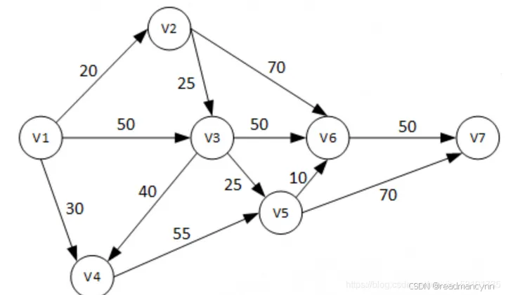
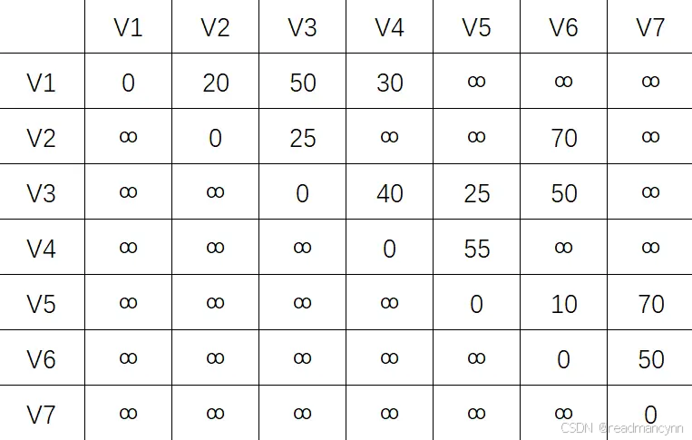
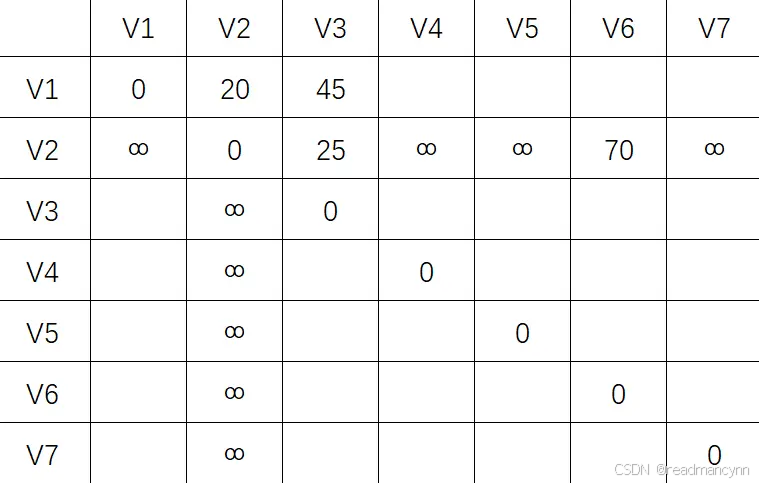
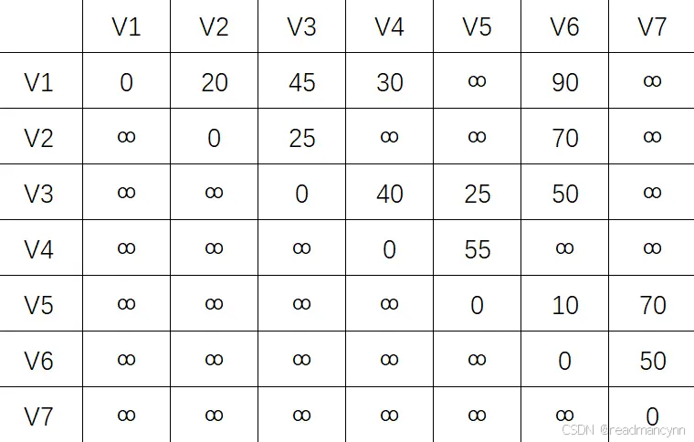
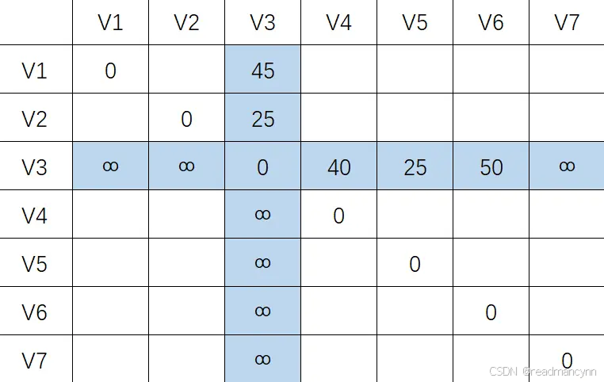
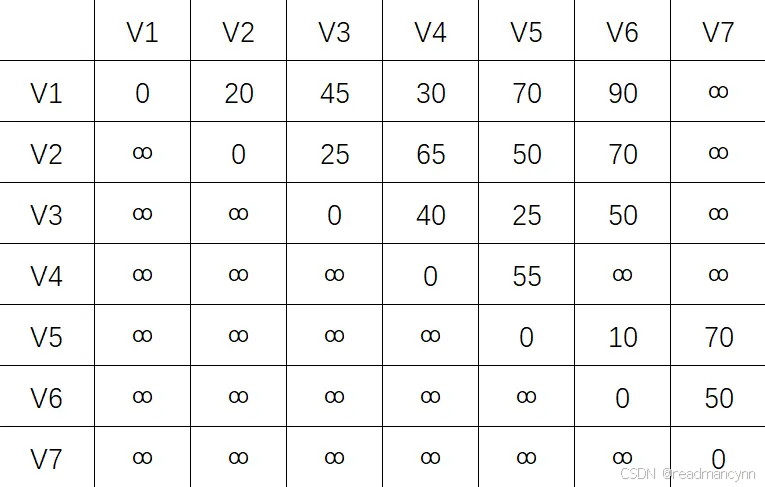
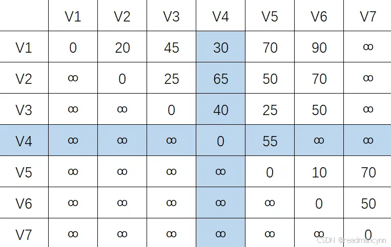
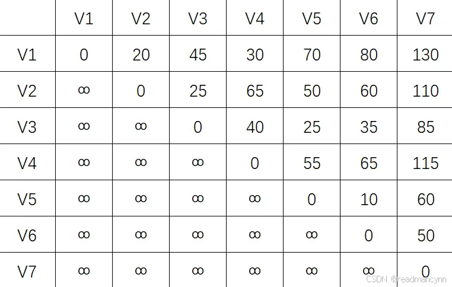
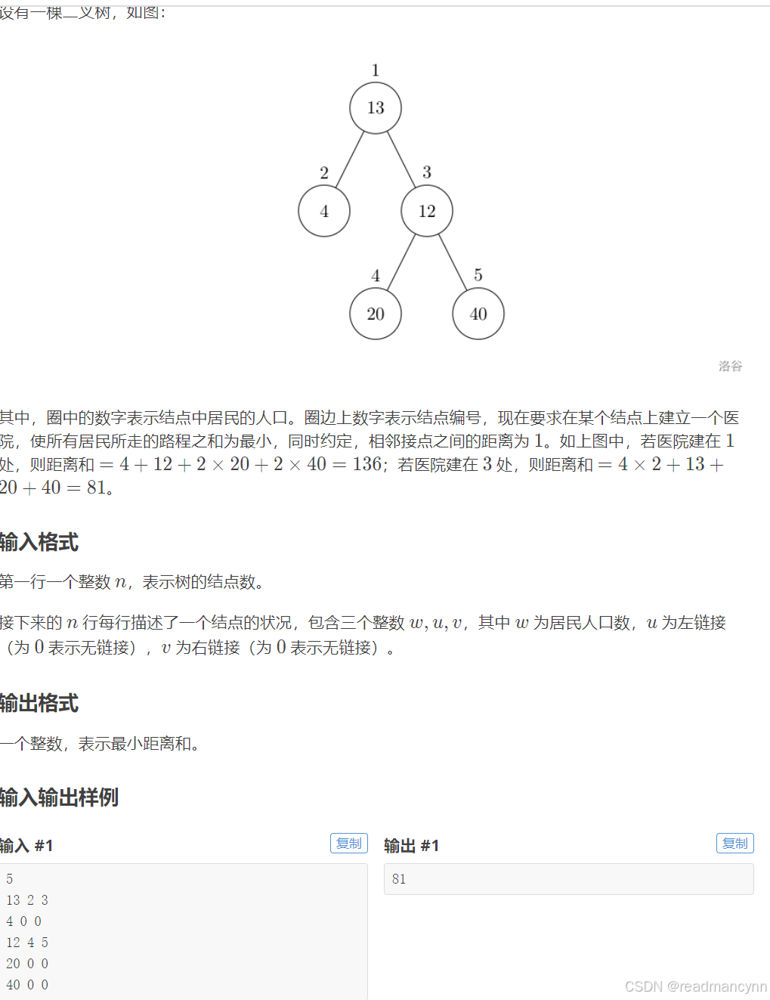

与迪杰斯特拉算法相似，弗洛伊德算法是一种计算最短路径的问题，与迪杰斯特拉算法不同的是，该算法可计算多源点带权图（可带负权值，但非负周期[1]）的最短路径的问题。

以上图为例，介绍如何手写。

首先写出该图的邻接矩阵，记作矩阵 P (-1) ：

接下来，我们保留V1行—V1列（即，将V1作为中转结点），同时保持对角线不变（自身到自身距离总是0），记作  P (V1)：

逐步更新：方法如下：寻找对应保留列的数字之和，若和小于上表原位置的数字，则更新，否则不更新。[2]

以（V2，V3）为例：

∞+50=∞，大于上一个表中的25，保留25，不做更新。
剩下的空缺均按照上述方法。得到的表如下：
接下来保留V2行列，保留对角线，记作P(V2)  ：

更新操作：和上面相同，以（V1，V3）为例：

20+25=45小于上图的50，故作更新

重复此步骤，得到下表：
接下来保留V3行列，记作  P(V3)：

按照方法执行更新；得到下表

继续绘制 P(V4)

 更新：

继续绘制P(V5) P(V6) P(V7)  ,最终得到下表：

该矩阵即为任意两点间的最短距离矩阵。
## 模版
~~~c
void floyd()
{
    int num;
    cin>>num;
    for(int i=1;i<=num;i++)
    {
        for(int j=1;j<=num;j++)
        {
            if(i==j)continue;
            else z[i][j]=0x3f3f3f3f;
        }
    }
    for(int k=1;k<=num;k++)
    {
        for(int i=1;i<=num;i++)
        {
            for(int j=1;j<=num;j++)
            {
                z[i][j]=min(z[i][j],z[i][k]+z[k][j]); 
            }
        }
    }
}
~~~
## 例题

## 题解
~~~c
#include<iomanip>//保留小数位数
#include<iostream> //c++
#include<algorithm> //sort排序
#include<cstring> //字符串
#include<math.h> //abs等函数
#include<map> //map
#include<set>//set
#include<cctype>
#define int long long //不开longlong见祖宗
#define endl '\n' //处理多数据时省时间
using namespace std;

int z[1110][1110];
int people[1110];
int num;
void floyd()
{
    for (int k = 1; k <= num; k++)
    {
        for (int i = 1; i <= num; i++)
        {
            for (int j = 1; j <= num; j++)
            {
                z[i][j] = min(z[i][k] + z[k][j],z[i][j]);
            }
        }
    }
}
signed main() {
    ios::sync_with_stdio(false);
    cin.tie(0); //cin减少时间
    cout.tie(0); //cout减少时间
    cin >> num;
    //初始化自己到自己的距离为0 其他的都为无穷大
    for (int i = 1; i <= num; i++)
    {
        for (int j = 1; j <= num; j++)
        {
            if (i == j) z[i][j] = 0;
            else z[i][j] = 0x3f3f3f3f;
        }
    }
    for (int i = 1; i <= num; i++)
    {
        int a, b, c;
        cin >> a >> b >> c;
        //记录当前医院的人数为a
        people[i] = a;
        if (b)
        {
            //双向的权值都赋值为1
            z[i][b] = 1;
            z[b][i] = 1;
        }
        if (c)
        {
            z[i][c] = 1;
            z[c][i] = 1;
        }
    }
    //使得两点的距离最小
    floyd();
    int ans = 0x3f3f3f3f;//先定义答案为无穷大
    //外层for循环定义结点 内层for循坏找答案
    for (int i = 1; i <= num; i++)
    {
        int sum = 0;
        for (int j = 1; j <= num; j++)
        {
            sum = sum + people[j] * z[i][j];//当前结点人数=j结点人数*ij之间的距离
        }
        ans = min(ans, sum);//找到最小值
    }
    cout << ans;

    return 0;
    //cout << setw(5) << setfill('0') << a << b;// 输出5位，右对齐，不足补0 。
}
~~~

