在写博客时，我们通常不使用csdn直接撰写，而是在本地使用[markdown编辑器](https://so.csdn.net/so/search?q=markdown编辑器&spm=1001.2101.3001.7020)，比如比较好用的Typora，但是在本地写完直接上传到csdn时会存在图片由于防盗链不显示的问题，本文记录如何解决该问题

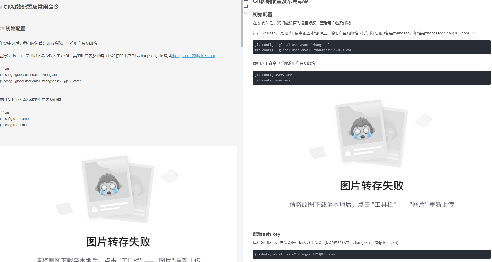

## 主要思想

将照片的[本地存储](https://so.csdn.net/so/search?q=本地存储&spm=1001.2101.3001.7020)改为线上存储，在导入后csdn通过线上访问的方式显示出来图片

## 实际操作

### Gitee新建仓库

把图片本地存储改为线上存储，此处使用gitee进行管理访问，不适用github的原因在于github有时不方便访问

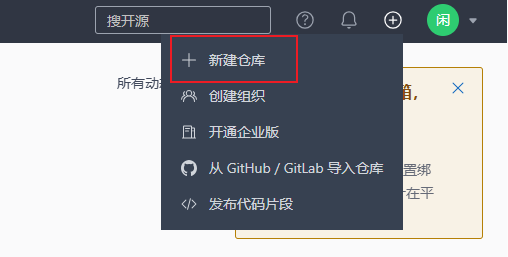

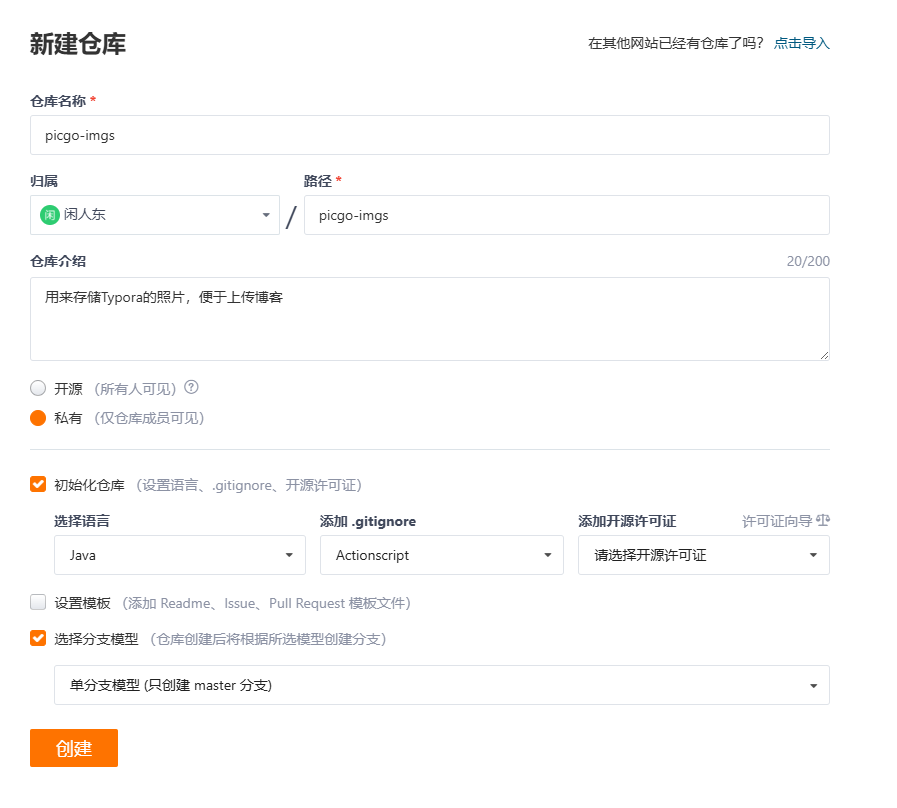

新建完成后我们会跳转到这里，点击图中管理

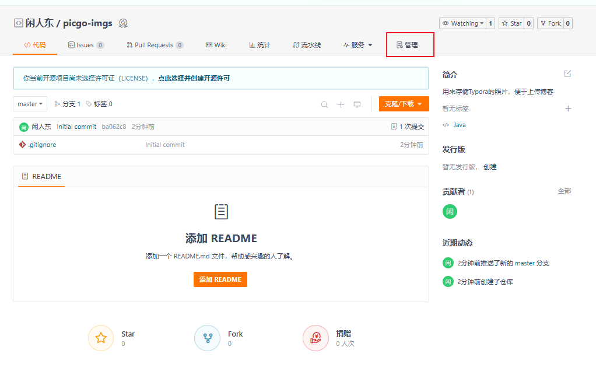

最下面的开源许可证记得自己选。我选的是MIT

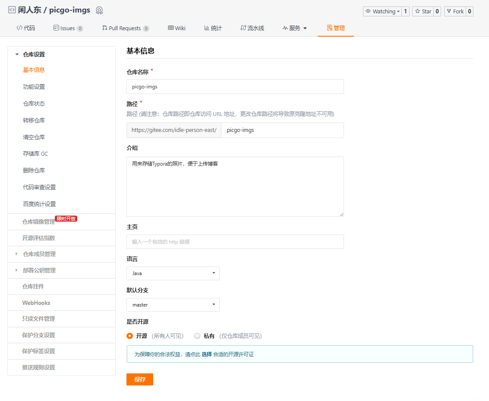

### 设置私人令牌
5
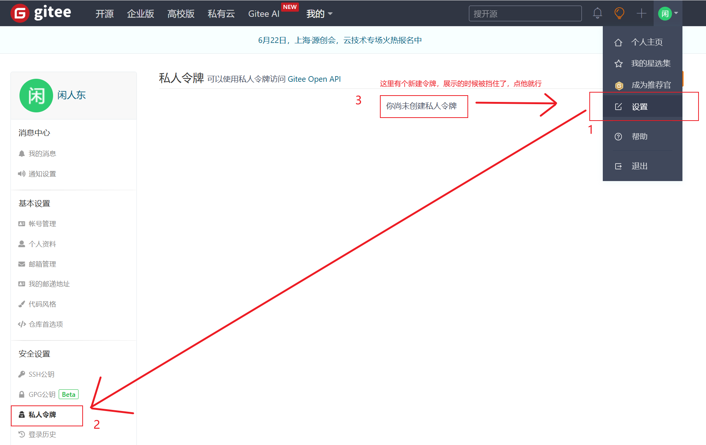

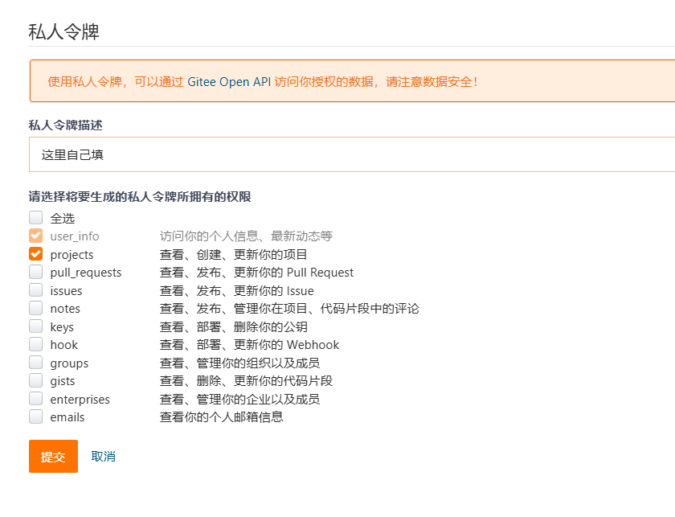

点确定之后，会让你输一遍自己gitee的密码，正常输就行，输完之后，会有个弹窗，写着你自己的私人令牌，**请妥善保存！！！请妥善保存！！！请妥善保存！！！**

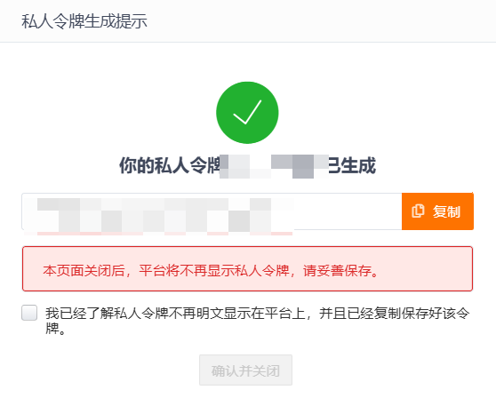

### PicGo配置

PicGo: 一个用于快速上传图片并获取图片 URL 链接的工具，本文要用到

这里提供山东大学镜像站下载地址，感谢广大镜像站做出的贡献

https://mirrors.sdu.edu.cn/github-release/Molunerfinn_PicGo

进来之后，按照自己系统版本下载对应版本，我这里选择x64版本

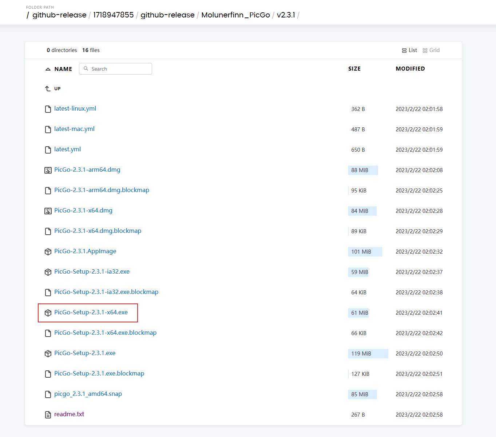

下载之后就是正常的安装程序，自己选择路径安装就行

安装好后打开软件，先在插件设置中搜索gitee，安装gitee-uploader，如图

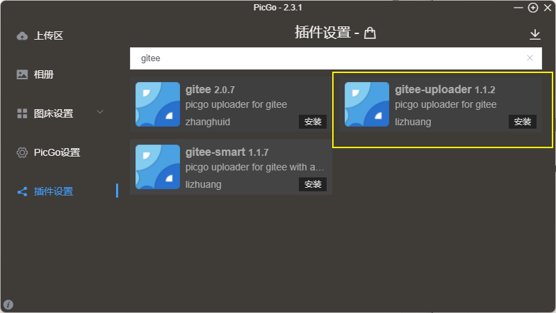

可能不用javascript的朋友这里会报缺失node.js，点击是他会自动给你跳转到node.js安装界面

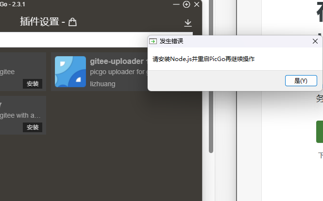

正常安装就行，然后重启PicGo继续安装插件

安装成功后依次点击图床设置-gitee，

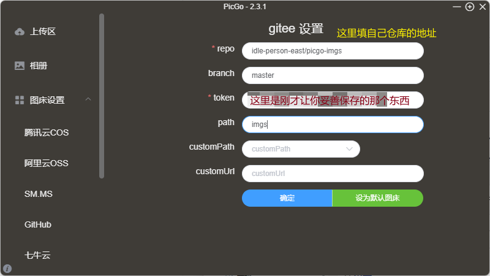

不知道自己仓库地址的回到刚才新建的仓库，自己看网址，比如我的是，我这里就填idle-person-east/picgo-imgs

在上传区选中<图片上传 - gitee > 然后随便拖一个图片到上传区
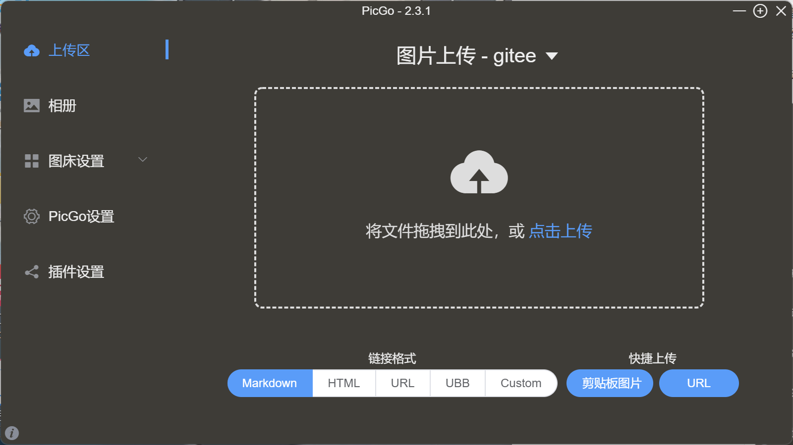

之后随便拖入一个照片到上传区进行实验

点击确定就好了

### Typora配置

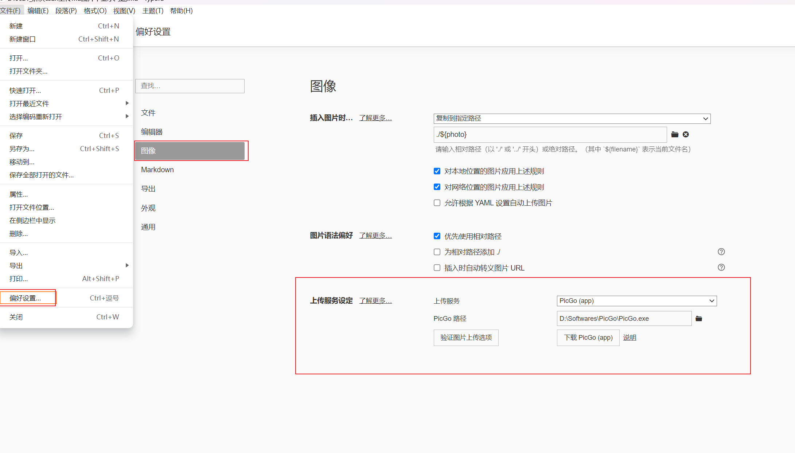

点击验证图片上传选项
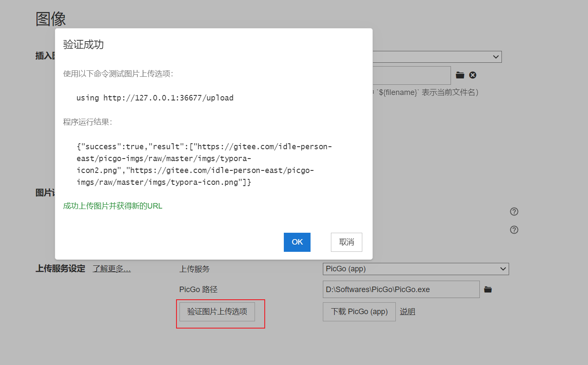

如果程序运行结果，success为false的话，就要去查看日志文件了，路线是这样的：

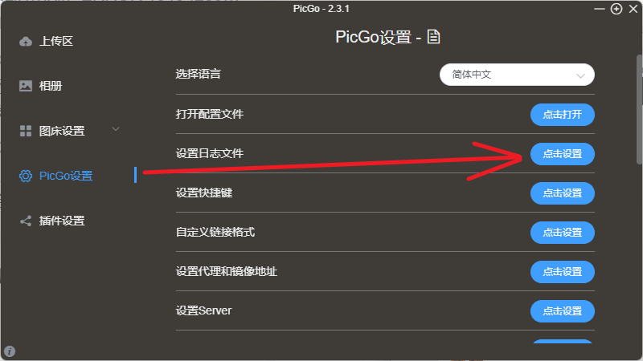

比如仓库中如果存在同样的文件的话是会报错的

### 导入测试

时再在csdn里面导入会发现。欸，没效果啊，你这不放屁呢吗，逗我玩儿呢

去到gitee的仓库里面，也只能看到刚才测试时上传的typora-icon.png，并没有自己markdown里面的图片。

欸，别急嘛，肯定要带你搞好的撒。

这里分两种情况：

已经写好的markdown里面有的图片上传
就直接把你本地的图片文件夹里面的图片上传到仓库里面就行，或者在你的Typora里面，右键点击图片，挨个点击上传，然后再把markdown导入csdn，发现，欸，图片显示出来了，我不是江湖骗子，哈哈

为以后更方便做准备
为了方便我们以后可以更加简单的复制粘贴图片，我们要打开Typora的这些设置

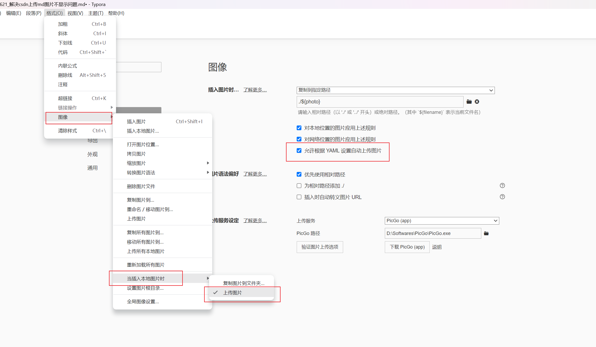

这就搞定咯，这样我们在每次插入图片时，他都会自动上传

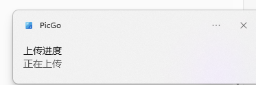

有人说，

——欸，我这没有弹这个啊

——那你设置没打开能弹嘛

——那怪你没教

好好好，现教，还是在PicGo里面，按如下设置

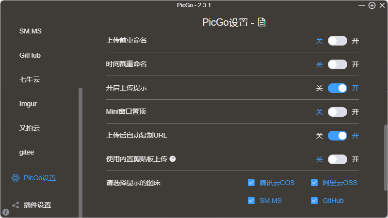

到现在就完结咯。
P（20240718补充）：使用中发现，如果需要在第二台电脑上同步开启此服务，所用gitee无需新建仓库，但是存放图片的文件夹需要重新新建一个，比如此处path改为imgs2，否则在验证上传时一直会报object object 的模糊错误：
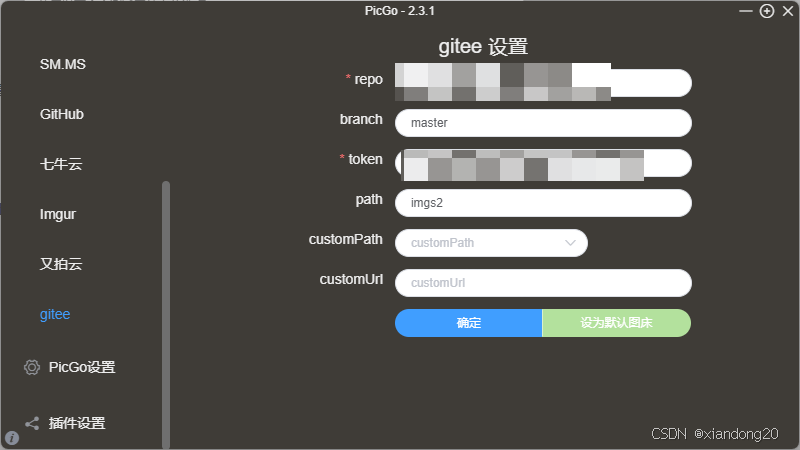

