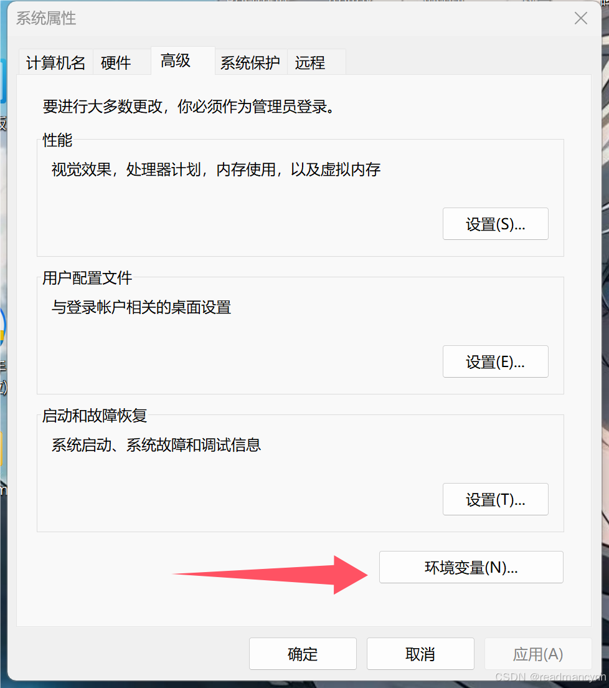
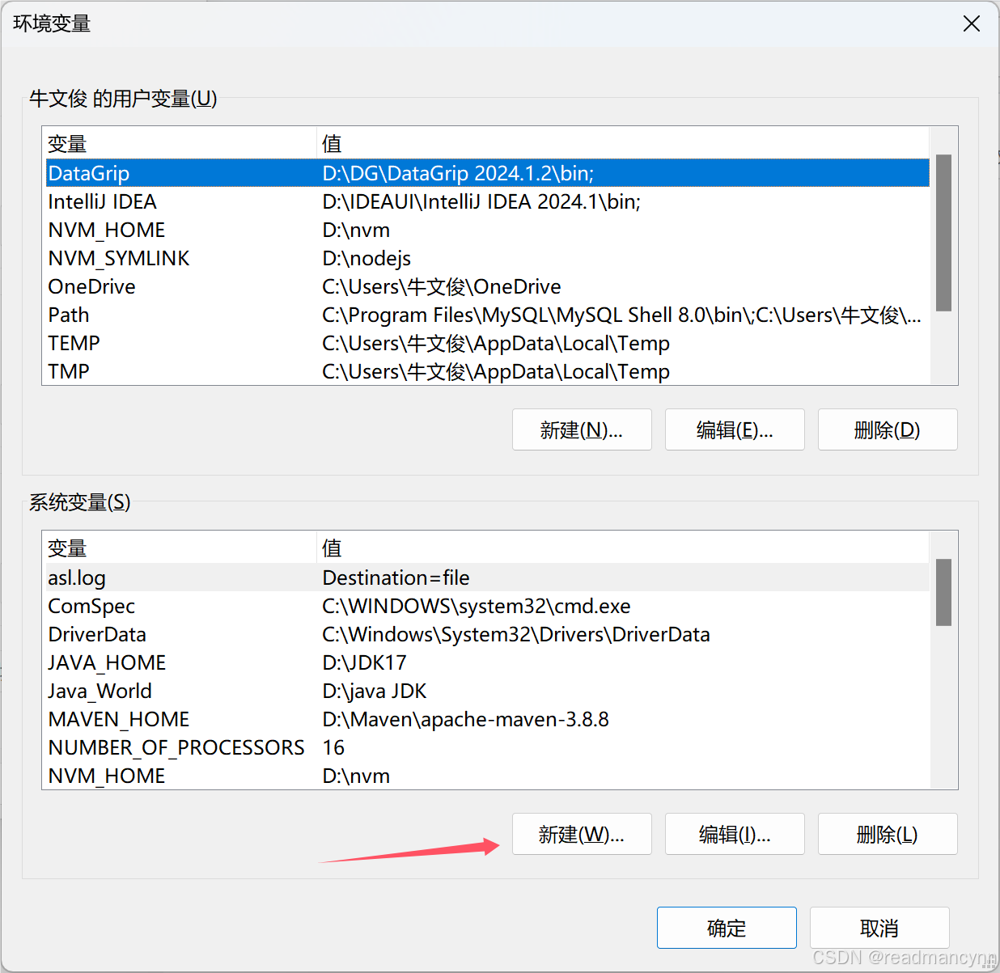
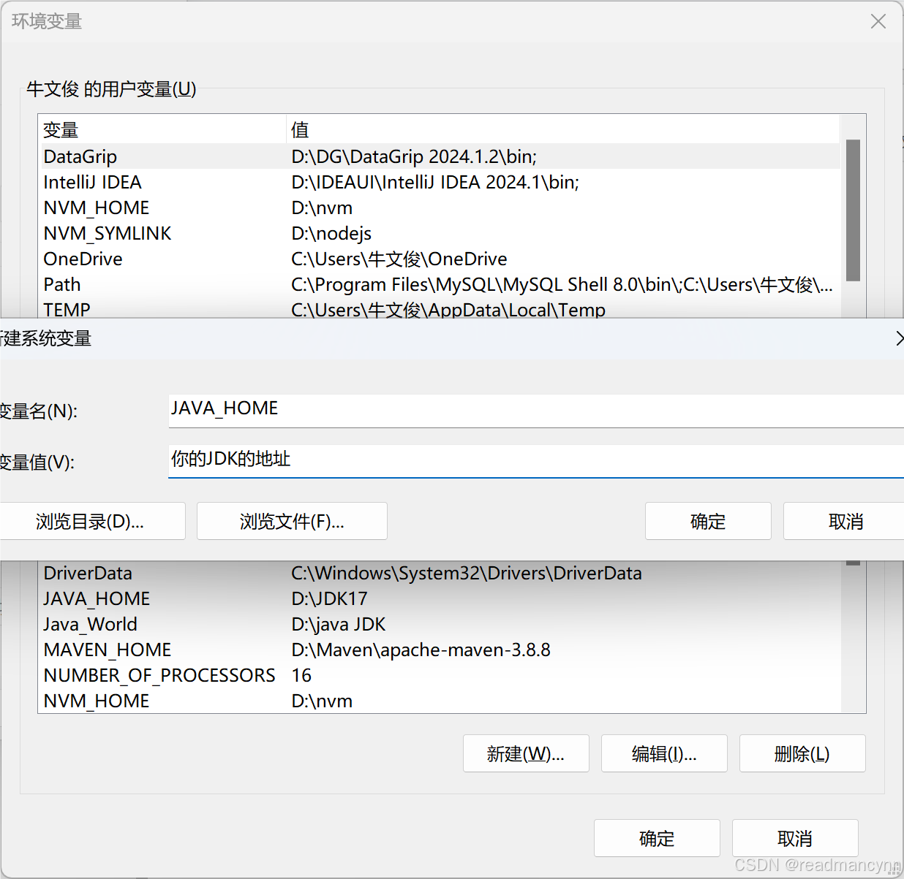

Tomcat服务器安装后，点击startup.bat 无法打开，就是闪一下，失败的原因有两个

<!-- more -->

(一) 环境变量有误
1.右键 此电脑 

2.选择 高级系统设置

 3.点击环境变量，配置JAVA_HOME

然后一直点击确定，最后重新启动 startup.bat 就可以啦~~~

（二）端口被占用
解决方法：① 修改端口号：Tomcat根目录—>cofn目录—>server.xml—>Connector标签—>修改port属性为所需要的端口号。注意：端口号范围：165535,11023为知名端口，102449151为用户端口，4915265535为动态端口。

