#  前端Vue核心
开发一个前端模块可以概括为以下几个步骤：
（1）写静态页面、拆分为静态组件；
（2）发请求（API）；
（3）vuex（actions、mutations、state三连操作）；
（4）组件获取仓库数据，动态展示；

<!--more-->


# 1、vue文件目录分析

**public文件夹**：静态资源，webpack进行打包的时候会原封不动打包到dist文件夹中。

**pubilc/index.html**是一个模板文件，作用是生成项目的入口文件，webpack打包的js,css也会自动注入到该页面中。我们浏览器访问项目的时候就会默认打开生成好的index.html。

**src文件夹**（程序员代码文件夹）

    assets： 存放公用的静态资源
    components： 非路由组件（全局组件），其他组件放在views或者pages文件夹中
    App.vue： 唯一的跟组件
    main.js： 程序入口文件，最先执行的文件

**babel.config.js**:  配置文件（babel相关）
**package.json**: 项目的详细信息记录
**package-lock.json**: 缓存性文件（各种包的来源）
# 2、项目配置
2.1 项目运行，浏览器自动打开
```js
package.json
    "scripts": {
    "serve": "vue-cli-service serve --open",
    "build": "vue-cli-service build",
    "lint": "vue-cli-service lint"
    },
```
2.2 关闭eslint校验工具（不关闭会有各种规范，不按照规范就会报错）   
- 根目录下创建vue.config.js,进行配置
```js
module.exports = {
  //关闭eslint
  lintOnSave: false
  }
```
2.3 src文件夹配置别名,创建jsconfig.json，用@/代替src/，exclude表示不可以使用该别名的文件
```js
 {
    "compilerOptions": {
        "baseUrl": "./",
            "paths": {
            "@/*": [
                "src/*"
            ]
        }
    },

    "exclude": [
        "node_modules",
        "dist"
    ]
 }
```
# 3、组件页面样式
组件页面的样式使用的是less样式，浏览器不识别该样式，需要下载相关依赖
`npm install --save less less-loader@5`
如果想让组件识别less样式，则在组件中设置
`<script scoped lang="less">`

# 4、清除vue页面默认的样式  
vue是单页面开发，我们只需要修改public下的index.html文件

`<link rel="stylesheet" href="reset.css">`

#  5、pages文件夹
创建pages文件夹，并创建路由组件
5.1创建router文件夹，并创建index.js进行路由配置，最终在main.js中引入注册

5.2 总结  
路由组件和非路由组件区别：
- 非路由组件放在components中，路由组件放在pages或views中
- 非路由组件通过标签使用，路由组件通过路由使用
- 在main.js注册玩路由，所有的路由和非路由组件身上都会拥有$router $route属性
- $router：一般进行编程式导航进行路由跳转
- $route： 一般获取路由信息（name path params等）

5.3 路由跳转方式   
- 声明式导航router-link标签 <router-link to=“path”>,可以把router-link理解为一个a标签，它 也可以加class修饰
- 编程式导航 ：声明式导航能做的编程式都能做，而且还可以处理一些业务

# 6、footer组件显示与隐藏

- footer在登录注册页面是不存在的，所以要隐藏，v-if 或者 v-show
- 这里使用v-show，因为v-if会频繁的操作dom元素消耗性能，v-show只是通过样式将元素显示或隐藏
- 配置路由的时候，可以给路由配置元信息meta,
- 在路由的原信息中定义show属性，用来给v-show赋值，判断是否显示footer组件

# 7、路由传参  
7.1、query、params
- query、params两个属性可以传递参数   
  query参数：不属于路径当中的一部分，类似于get请求，地址栏表现为 /search?k1=v1&k2=v2  
  query参数对应的路由信息 `path: "/search"`  
  params参数：属于路径当中的一部分，需要注意，在配置路由的时候，需要**占位** ,地址栏表现为 /search/v1/v2  
  params参数对应的路由信息要修改为`path: "/search/:keyword"`  这里的/:keyword就是一个params参数的占位符  
- params传参问题  
  （1）、如何指定params参数可传可不传  
```js
  如果路由path要求传递params参数,但是没有传递,会发现地址栏URL有问题，详情如下：
  Search路由项的path已经指定要传一个keyword的params参数，如下所示：
  path: "/search/:keyword",
  执行下面进行路由跳转的代码：
  this.$router.push({name:"Search",query:{keyword:this.keyword}})
  当前跳转代码没有传递params参数
  地址栏信息：http://localhost:8080/#/?keyword=asd
  此时的地址信息少了/search
  正常的地址栏信息: http://localhost:8080/#/search?keyword=asd
  解决方法：可以通过改变path来指定params参数可传可不传 
  path: "/search/:keyword?",?表示该参数可传可不传
```
参考连接：https://blog.csdn.net/weixin_44867717/article/details/109773945  
（2）、由（1）可知params可传可不传，但是如果传递的时空串，如何解决  。
```js
 this.$router.push({name:"Search",query:{keyword:this.keyword},params:{keyword:''}})
 出现的问题和1中的问题相同,地址信息少了/search
 解决方法： 加入||undefined，当我们传递的参数为空串时地址栏url也可以保持正常
 this.$router.push({name:"Search",query:{keyword:this.keyword},params:{keyword:''||undefined}})
```
（3）路由组件能不能传递props数据？  
可以，但是只能传递params参数,具体知识为props属性  。
7.2、传参方法
- 字符串形式    
  this.$router.push("/search/"+this.params传参+"?k="+this.query传参)
- 模板字符串  
  this.$router.push("/search/+${this.params传参}?k=${this.query传参}")  
  **注意**： 上面字符串的传参方法可以看出params参数和'/'结合，query参数和？结合  
  `http://localhost:8080/#/search/asd?keyword=asd`  
  上面url中asd为params的值，keyword=asd为query传递的值。
- 对象（常用）   
  this.$router.push({name:"路由名字",params:{传参},query:{传参})。  
  以对象方式传参时，如果我们传参中使用了params，只能使用name，不能使用path，如果只是使用query传参，可以使用path  。

# 8、多次执行相同的push问题
多次执行相同的push问题，控制台会出现警告  
例如：使用this.$router.push({name:'Search',params:{keyword:".."||undefined}})时，如果多次执行相同的push，控制台会出现警告。
```js
let result = this.$router.push({name:"Search",query:{keyword:this.keyword}})
console.log(result)
```
执行一次上面代码：  

多次执行出现警告：  
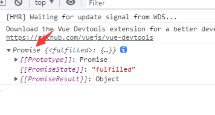
原因：push是一个promise，promise需要传递成功和失败两个参数，我们的push中没有传递。   
方法：this.$router.push({name:'Search',params:{keyword:".."||undefined}},()=>{},()=>{})后面两项分别代表执行成功和失败的回调函数。  
**这种写法治标不治本，将来在别的组件中push|replace,编程式导航还是会有类似错误**  
push是VueRouter.prototype的一个方法，在router中的index重写该方法即可(看不懂也没关系，这是前端面试题)
```js
//1、先把VueRouter原型对象的push，保存一份
let originPush = VueRouter.prototype.push;
//2、重写push|replace
//第一个参数：告诉原来的push，跳转的目标位置和传递了哪些参数
VueRouter.prototype.push = function (location,resolve,reject){
    if(resolve && reject){
        originPush.call(this,location,resolve,reject)
    }else{
        originPush.call(this,location,() => {},() => {})
    }
}
```

# 9、定义全局组件
我们的三级联动组件是全局组件，全局的配置都需要在main.js中配置  
```js
//将三级联动组件注册为全局组件
import TypeNav from '@/pages/Home/TypeNav';
//第一个参数：全局组件名字，第二个参数：全局组件
Vue.component(TypeNav.name,TypeNav);
```
在Home组件中使用该全局组件
```js
<template>
<div>
<!--  三级联动全局组件已经注册为全局组件，因此不需要引入-->
  <TypeNav/>
</div>
</template>

```
全局组件可以在任一页面中直接使用，不需要导入声明  
下面全部商品分类就是三级联动组件  

# 10、代码改变时实现页面自动刷新
根目录下vue.config.js文件设置
```js
module.exports = {
    //关闭eslint
    lintOnSave: false,
    devServer: {
        // true 则热更新，false 则手动刷新，默认值为 true
        inline: true,
        // development server port 8000
        port: 8001,

    }
}
```
注意：修改完该配置文件后，要重启一下项目
#  11、Home首页其它组件
home文件夹index.vue
```js
<template>
<div>
<!--  三级联动全局组件已经注册为全局组件，因此不需要引入-->
  <TypeNav/>
<!--  轮播图列表-->
  <ListContainer/>
<!--  今日推荐-->
  <Recommend/>
<!--  商品排行-->
  <Rank/>
<!--  猜你喜欢-->
  <Like/>
<!-- 楼层 -->
  <Floor/>
  <Floor/>
<!--  商标-->
  <Brand/>
</div>
</template>

<script>
import ListContainer from './ListContainer'
import Recommend from './Recommend'
import Rank from './Rank'
import Like from './Like'
import Floor from './Floor'
import Brand from './Brand'
export default {
  name: "index",
  components: {
    ListContainer,
    Recommend,
    Rank,
    Like,
    Floor,
    Brand,
  }
}
</script>

<style scoped>

</style>
```
# 12、封装axios
axios中文文档，包含详细信息。
[https://www.kancloud.cn/yunye/axios/234845](https://www.kancloud.cn/yunye/axios/234845)
在根目录下创建api文件夹，创建request.js文件。
内容如下，当前文件代码还比较少，后续有需求可以增添内容。
```js
import axios from "axios";
//1、对axios二次封装
const requests = axios.create({
    //基础路径，requests发出的请求在端口号后面会跟改baseURl
    baseURL:'/api',
    timeout: 5000,
})
//2、配置请求拦截器
requests.interceptors.request.use(config => {
    //config内主要是对请求头Header配置
    //比如添加token
    
    return config;
})
//3、配置相应拦截器
requests.interceptors.response.use((res) => {
    //成功的回调函数
    return  res.data;
},(error) => {
    //失败的回调函数
    console.log("响应失败"+error)
    return Promise.reject(new Error('fail'))
})
//4、对外暴露
export default requests;
```
# 13、前端通过代理解决跨域问题
在根目录下的vue.config.js中配置,proxy为通过代理解决跨域问题。
我们在封装axios的时候已经设置了baseURL为api,所以所有的请求都会携带/api，这里我们就将/api进行了转换。如果你的项目没有封装axios，或者没有配置baseURL，建议进行配置。要保证baseURL和这里的代理映射相同，此处都为'/api'。
```js
module.exports = {
    //关闭eslint
    lintOnSave: false,
    devServer: {
        // true 则热更新，false 则手动刷新，默认值为 true
        inline: false,
        // development server port 8000
        port: 8001,
        //代理服务器解决跨域
        proxy: {
            //会把请求路径中的/api换为后面的代理服务器
            '/api': {
                //提供数据的服务器地址
                target: 'http://39.98.123.211',

            }
        },
    }
}
```
[webpack官网相关知识解读](https://webpack.docschina.org/configuration/dev-server/#devserverproxy)
网站中的webpack.config.js就是vue.config.js文件。
# 14、请求接口统一封装
在文件夹api中创建index.js文件，用于封装所有请求
**将每个请求封装为一个函数，并暴露出去，组件只需要调用相应函数即可，这样当我们的接口比较多时，如果需要修改只需要修改该文件即可。**

如下所示：
```js
//当前模块，API进行统一管理，即对请求接口统一管理
import requests from "@/api/request";

//首页三级分类接口
export const reqCateGoryList = () => {
    return  requests({
        url: '/product/getBaseCategoryList',
        method: 'GET'
    })
}
```
当组件想要使用相关请求时，只需要导入相关函数即可，以上图的reqCateGoryList 为例:
```js
import {reqCateGoryList} from './api'
//发起请求
reqCateGoryList();
```
# 15、nprogress进度条插件
打开一个页面时，往往会伴随一些请求，并且会在页面上方出现进度条。它的原理时，在我们发起请求的时候开启进度条，在请求成功后关闭进度条，所以只需要在request.js中进行配置。
如下图所示，我们页面加载时发起了一个请求，此时页面上方出现蓝色进度条
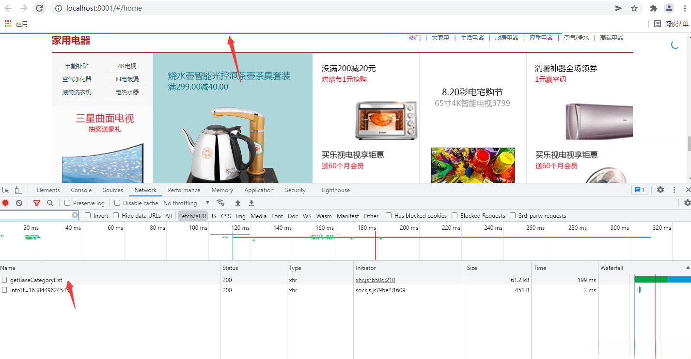
对应的request.js设置

```js
import axios from "axios";
//引入进度条
import nprogress from 'nprogress';
//引入进度条样式
import "nprogress/nprogress.css";
//1、对axios二次封装
const requests = axios.create({
    //基础路径，requests发出的请求在端口号后面会跟改baseURl
    baseURL:'/api',
    timeout: 5000,
})
//2、配置请求拦截器
requests.interceptors.request.use(config => {
    //config内主要是对请求头Header配置
    //比如添加token

    //开启进度条
    nprogress.start();
    return config;
})
//3、配置相应拦截器
requests.interceptors.response.use((res) => {
    //成功的回调函数

    //响应成功，关闭进度条
    nprogress.done()
    return  res.data;
},(error) => {
    //失败的回调函数
    console.log("响应失败"+error)
    return Promise.reject(new Error('fail'))
})
//4、对外暴露
export default requests;
```
可以通过修改nprogress.css文件的background来修改进度条颜色。
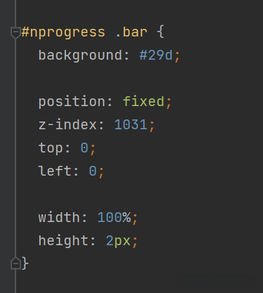
# 16、手动引入vuex
首先确保安装了vuex,根目录创建store文件夹，文件夹下创建index.js，内容如下：
```js
import Vue from 'vue'
import Vuex from 'vuex'

Vue.use(Vuex)

//对外暴露store的一个实例
export default new Vuex.Store({
    state:{},
    mutations:{},
    actions:{},
    
})
```
如果想要使用vuex，还要再main.js中引入
main.js:  
(1) 引入文件
(2) 注册store
**但凡是在main.js中的Vue实例中注册的实体，在所有的组件中都会有（this.$.实体名）属性**
```js
import store from './store'
new Vue({
  render: h => h(App),
  //注册路由，此时组件中都会拥有$router $route属性
  router,
  //注册store,此时组件中都会拥有$store
  store
}).$mount('#app')
```
# 17、async await使用
如果我们没有封装请求api，而是直接调用axios，就不需要使用async await。
案例：我们将一个axios请求封装为了函数，我们在下面代码中调用了该函数：
```js
import {reqCateGoryList} from '@/api'
export default {
    actions:{
        categoryList(){
            let result =  reqCateGoryList()
            console.log(result)
        }
    }
}
```
浏览器结果
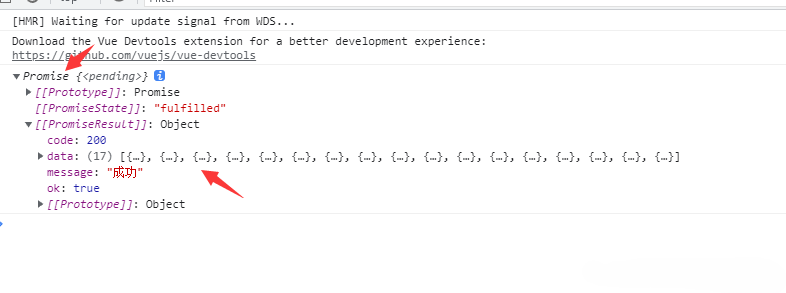
返回了一个promise,证明这是一个promise请求，但是我们想要的是图片中的data数据。
没有将函数封装前我们都会通过then()回调函数拿到服务器返回的数据，现在我们将其封装了，依然可以使用then获取数据，代码如下

```js
actions:{
        categoryList(){
            let result =  reqCateGoryList().then(
                res=>{
                console.log("res")
                console.log(res)
                return res
                }
            )
            console.log("result")
            console.log(result)
        }
    }
```
结果

由于我们的promis是异步请求，我们发现请求需要花费时间，但是它是异步的，所有后面的console.log("result")；console.log(result)会先执行，等我们的请求得到响应后，才执行console.log("res")；console.log(res)，这也符合异步的原则，但是我们如果在请求下面啊执行的是将那个请求的结果赋值给某个变量，这样就会导致被赋值的变量先执行，并且赋值为undefine，因为此时promise还没有完成。

所以我们引入了async await,async写在函数名前，await卸载api函数前面。await含义是**async标识的函数体内的并且在await标识代码后面的代码**先等待await标识的异步请求执行完，再执行。这也使得只有reqCateGoryList执行完，result 得到返回值后，才会执行后面的输出操作。

```js
   async categoryList(){
            let result = await reqCateGoryList()
            console.log("result")
            console.log(result)
        }
```
结果


# 18、vuex（*****）
state、actions、mutations、getters的辅助函数使用，当多次访问store中的上述属性时，要使用个属性的辅助函数，可以减少代码量。
**在使用上面的函数时，如果需要传递多个参数，需要把多个参数组合为一个对象传入(vuex是不允许多个参数分开传递的)**。
```js
async addOrUpdateShopCart({commit},{skuId,skuNum}){
        let result = await reqAddOrUpdateShopCart(skuId,skuNum)
        console.log(result)
        if(result.data ===  200){

        }
```
[辅助函数官网链接](https://vuex.vuejs.org/zh/guide/state.html#%E5%9C%A8-vue-%E7%BB%84%E4%BB%B6%E4%B8%AD%E8%8E%B7%E5%BE%97-vuex-%E7%8A%B6%E6%80%81)
**注意**：**使用action时，函数的第一个参数，必须是{commit}**，即使不涉及到mutations操作，也必须加上该参数，否则会报错。
# 19、loadsh插件防抖和节流
在进行窗口的resize、scroll，输入框内容校验等操作时，如果事件处理函数调用的频率无限制，会加重浏览器的负担，导致用户体验非常糟糕。此时我们可以采用debounce（防抖）和throttle（节流）的方式来减少调用频率，同时又不影响实际效果。 
安装lodash插件，该插件提供了防抖和节流的函数，我们可以引入js文件，直接调用。当然也可以自己写防抖和节流的函数
[lodash官网](https://www.lodashjs.com/)
[防抖函数](https://www.lodashjs.com/docs/lodash.debounce)
[节流函数](https://www.lodashjs.com/docs/lodash.throttle)
防抖：用户操作很频繁，但是只执行一次，减少业务负担。
节流：用户操作很频繁，但是把频繁的操作变为少量的操作，使浏览器有充分时间解析代码
[防抖和节流简述](https://www.jianshu.com/p/c8b86b09daf0)
例如：下面代码就是将changeIndex设置了节流，如果操作很频繁，限制50ms执行一次。这里函数定义采用的键值对形式。throttle的返回值就是一个函数，所以直接键值对赋值就可以，函数的参数在function中传入即可。
```js
import {throttle} from 'lodash'

 methods: {
    //鼠标进入修改响应元素的背景颜色
    //采用键值对形式创建函数，将changeIndex定义为节流函数，该函数触发很频繁时，设置50ms才会执行一次
    changeIndex: throttle(function (index){
      this.currentIndex = index
    },50),
    //鼠标移除触发时间
    leaveIndex(){
      this.currentIndex = -1
    }
  }
```
# 20、编程式导航+事件委托实现路由跳转
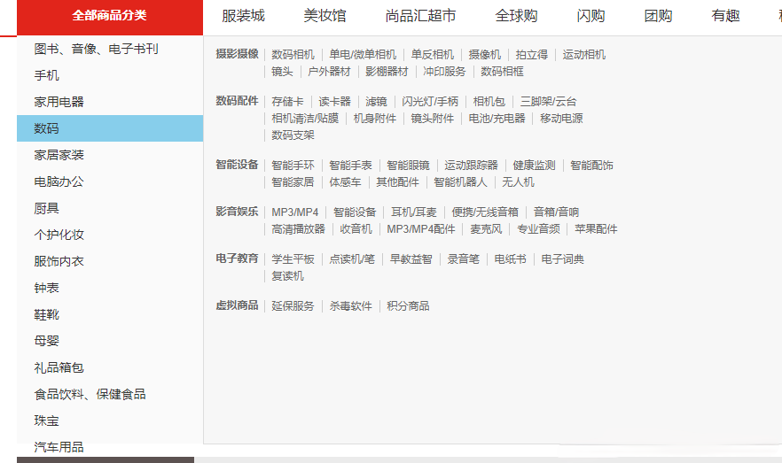
如上图所示，三级标签列表有很多，每一个标签都是一个页面链接，我们要实现通过点击表现进行路由跳转。
路由跳转的两种方法：导航式路由，编程式路由。

> 	对于导航式路由，我们有多少个a标签就会生成多少个router-link标签，这样当我们频繁操作时会出现卡顿现象。
> 		对于编程式路由，我们是通过触发点击事件实现路由跳转。同理有多少个a标签就会有多少个触发函数。虽然不会出现卡顿，但是也会影响性能。

上面两种方法无论采用哪一种，都会影响性能。我们提出一种：编程时导航+事件委派 的方式实现路由跳转。事件委派即把子节点的触发事件都委托给父节点。这样只需要一个回调函数goSearch就可以解决。
**事件委派问题：**
（1）如何确定我们点击的一定是a标签呢？如何保证我们只能通过点击a标签才跳转呢？
（2）如何获取子节点标签的商品名称和商品id(**我们是通过商品名称和商品id进行页面跳转的**)

**解决方法：**
对于问题1：为三个等级的a标签添加自定义属性date-categoryName绑定商品标签名称来标识a标签（其余的标签是没有该属性的）。

对于问题2：为三个等级的a标签再添加自定义属性data-category1Id、data-category2Id、data-category3Id来获取三个等级a标签的商品id，用于路由跳转。
我们可以通过在函数中传入event参数，获取当前的点击事件，通过event.target属性获取当前点击节点，再通过dataset属性获取节点的属性信息。
```js
 <div class="all-sort-list2" @click="goSearch" @mouseleave="leaveIndex">
          <div class="item"  v-for="(c1,index) in categoryList" v-show="index!==16" :key="c1.categoryId" :class="{cur:currentIndex===index}">
            <h3 @mouseenter="changeIndex(index)"  >
              <a :data-categoryName="c1.categoryName" :data-category1Id="c1.categoryId" >{{c1.categoryName}}</a>
            </h3>
            <div class="item-list clearfix" :style="{display:currentIndex===index?'block':'none'}">
              <div class="subitem" v-for="(c2,index) in c1.categoryChild" :key="c2.categoryId">
                <dl class="fore">
                  <dt>
                    <a :data-categoryName="c2.categoryName" :data-category2Id="c2.categoryId">{{c2.categoryName}}</a>
                  </dt>
                  <dd>
                    <em v-for="(c3,index) in c2.categoryChild"  :key="c3.categoryId">
                      <a :data-categoryName="c2.categoryName" :data-category3Id="c3.categoryId">{{c3.categoryName}}</a>
                    </em>
</dd></dl></div></div></div></div>
```
**注意**：event是系统属性，所以我们只需要在函数定义的时候作为参数传入，在函数使用的时候不需要传入该参数。
```js
//函数使用
<div class="all-sort-list2" @click="goSearch" @mouseleave="leaveIndex">
//函数定义
goSearch(event){
      console.log(event.target)
    }
```
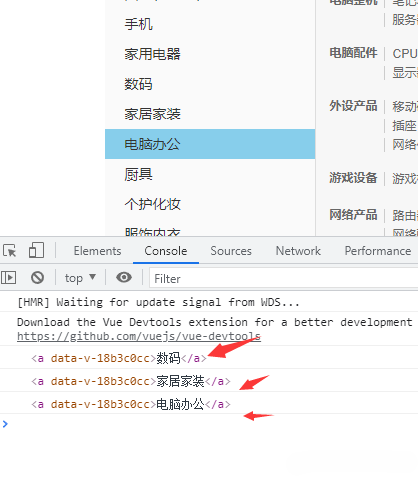
对应的goSearrch函数

```js
goSearch(event){
      let element = event.target
      //html中会把大写转为小写
      //获取目前鼠标点击标签的categoryname,category1id,category2id,category3id，
      // 通过四个属性是否存在来判断是否为a标签，以及属于哪一个等级的a标签
      let {categoryname,category1id,category2id,category3id} = element.dataset


      //categoryname存在，表示为a标签
      if(categoryname){
        //category1id一级a标签
        //整理路由跳转的参数
        let location = {name:'Search'}//跳转路由name
        let query = {categoryName:categoryname}//路由参数

        if(category1id){
          query.category1Id = category1id
        }else if(category2id){
        //category2id二级a标签
          query.category2Id = category2id
        }else if(category3id){
        //category3id三级a标签
          query.category3Id = category3id
        }
        //整理完参数
        location.query = query
        //路由跳转
        this.$router.push(location)

      }
    },
```
#  21、Vue路由销毁问题
**Vue在路由切换的时候会销毁旧路由**。
我们在三级列表全局组件TypeNav中的mounted进行了请求一次商品分类列表数据。
由于**Vue在路由切换的时候会销毁旧路由**，当我们再次使用三级列表全局组件时还会发一次请求。
如下图所示：当我们在包含三级列表全局组件的不同组件之间进行切换时，都会进行一次信息请求。
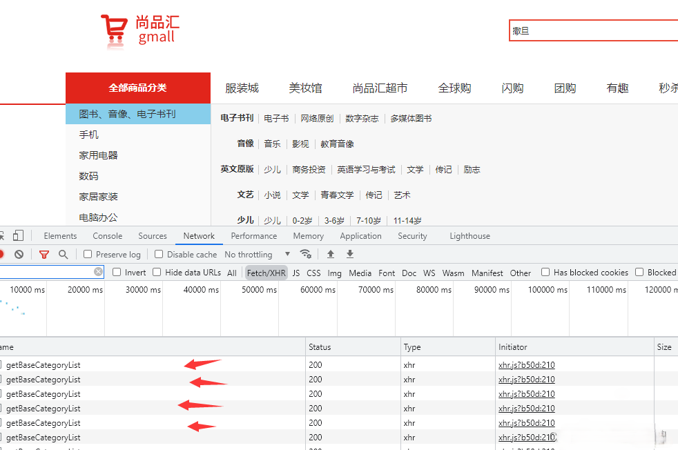
由于信息都是一样的，出于性能的考虑我们希望该数据只请求一次，所以我们把这次请求放在App.vue的mounted中。（根组件App.vue的mounted只会执行一次）
**注意**：虽然main.js也是只执行一次，但是不可以放在main.js中。因为只有组件的身上才会有$store属性。

# 22、mock插件使用
mock用来拦截前端ajax请求，返回我么们自定义的数据用于测试前端接口。
将不同的数据类型封装为不同的json文件，创建mockServer.js文件
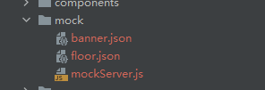
banner、floor分别为轮播图和页面底部的假数据。
mockServer.js文件

```js
import Mock  from 'mockjs'
//webpack默认对外暴露：json、图片
import banner from './banner.json'
import floor from './floor.json'

//mock数据：第一个参数请求地址、第二个参：请求数据
Mock.mock("/mock/banner",{code:200,data:banner})
Mock.mock("/mock/floor",{code:200,data:floor})
//记得要在main.js中引入一下
//import ''@/mock/mockServer
```
# 23、vuex数据存储与使用
我们会把公共的数据放在store中，然后使用时再去store中取。
以我们的首页轮播图数据为例。
1、在轮播图组件ListContainer.vue组件加载完毕后发起轮播图数据请求。
```js
 mounted() {
    this.$store.dispatch("getBannerList")
  },
```
2、请求实际是在store中的actions中完成的
```js
actions:{
        //获取首页轮播图数据
        async getBannerList({commit}){
            let result = await reqGetBannerList()
            if(result.code ===  200){
                commit("BANNERLIST",result.data)
            }
        }
    }
```
3、获取到数据后存入store仓库，在mutations完成
```js
/唯一修改state的部分
    mutations:{
        BANNERLIST(state,bannerList){
            state.bannerList = bannerList
        }
    },
```
4、轮播图组件ListContainer.vue组件在store中获取轮播图数据。由于在这个数据是通过异步请求获得的，所以我们要通过计算属性computed获取轮播图数据。
ListContainer.vue代码
```js
 <script>
import {mapState} from "vuex";
export default {
  name: "index",
  //主键挂载完毕，请求轮播图图片
  mounted() {
    this.$store.dispatch("getBannerList")
  },
  computed:{
    ...mapState({
      bannerList: (state => state.home.bannerList)
    })
  }
}
</script>
```
**总结**：只要是公共数据都会放在store中，之后的实现步骤就是上面的固定步骤。
# 24、swiper插件实现轮播图
[swiper官网](https://www.swiper.com.cn/usage/index.html)
官网中给出了代码实例：
做一个简要总结：（代码可以直接复制本小节最后面的代码）

> （1）安装swiper
>  （2）在需要使用轮播图的组件内导入swpier和它的css样式
>  （3）在组件中创建swiper需要的dom标签（html代码，参考官网代码）
>  （4）创建swiper实例

**注意**：在创建swiper对象时，我们会传递一个参数用于获取展示轮播图的DOM元素，官网直接通过class（**而且这个class不能修改，是swiper的css文件自带的**）获取。但是这样有缺点：当页面中有多个轮播图时，因为它们使用了相同的class修饰的DOM，就会出现所有的swiper使用同样的数据，这肯定不是我们希望看到的。
解决方法：在轮播图最外层DOM中添加ref属性
`<div class="swiper-container" id="mySwiper" ref="cur">`
通过ref属性值获取DOM
`let mySwiper = new Swiper(this.$refs.cur,{...})`
```js
 <!--banner轮播-->
        <div class="swiper-container" id="mySwiper" ref="cur">

          <div class="swiper-wrapper">
            <div class="swiper-slide" v-for="(carouse,index) in bannerList" :key="carouse.id">
              
            </div>
          </div>

          <!-- 如果需要分页器 -->
          <div class="swiper-pagination"></div>

          <!-- 如果需要导航按钮 -->
          <div class="swiper-button-prev" ></div>
          <div class="swiper-button-next"></div>
        </div>
<script>
//引入Swiper
import Swiper from 'swiper'
//引入Swiper样式
import 'swiper/css/swiper.css'
</script>
```
接下来要考虑的是什么时候去加载这个swiper，我们第一时间想到的是在mounted中创建这个实例。
但是会出现无法加载轮播图片的问题。
原因：

> 我们在mounted中先去异步请求了轮播图数据，然后又创建的swiper实例。由于请求数据是异步的，所以浏览器不会等待该请求执行完再去创建swiper，而是先创建了swiper实例，但是此时我们的轮播图数据还没有获得，就导致了轮播图展示失败。

```js
mounted() {
	//请求数据
    this.$store.dispatch("getBannerList")
    //创建swiper实例
    let mySwiper = new Swiper(document.getElementsByClassName("swiper-container"),{
        pagination:{
          el: '.swiper-pagination',
          clickable: true,
        },
        // 如果需要前进后退按钮
        navigation: {
          nextEl: '.swiper-button-next',
          prevEl: '.swiper-button-prev',
        },
        // 如果需要滚动条
        scrollbar: {
          el: '.swiper-scrollbar',
        },
      })
  },
```
解决方法一：等我们的数据请求完毕后再创建swiper实例。只需要加一个1000ms时间延迟再创建swiper实例.。将上面代码改为：
```js
mounted() {
    this.$store.dispatch("getBannerList")
    setTimeout(()=>{
      let mySwiper = new Swiper(document.getElementsByClassName("swiper-container"),{
        pagination:{
          el: '.swiper-pagination',
          clickable: true,
        },
        // 如果需要前进后退按钮
        navigation: {
          nextEl: '.swiper-button-next',
          prevEl: '.swiper-button-prev',
        },
        // 如果需要滚动条
        scrollbar: {
          el: '.swiper-scrollbar',
        },
      })
    },1000)
  },
```
方法一肯定不是最好的，但是我们开发的第一要义就是实现功能，之后再完善。

解决方法二：我们可以使用watch监听bannerList轮播图列表属性，因为bannerList初始值为空，当它有数据时，我们就可以创建swiper对象
```js
watch:{
    bannerList(newValue,oldValue){
        let mySwiper = new Swiper(this.$refs.cur,{
          pagination:{
            el: '.swiper-pagination',
            clickable: true,
          },
          // 如果需要前进后退按钮
          navigation: {
            nextEl: '.swiper-button-next',
            prevEl: '.swiper-button-prev',
          },
          // 如果需要滚动条
          scrollbar: {
            el: '.swiper-scrollbar',
          },
        })
    }
  }
```
即使这样也还是无法实现轮播图，原因是，我们轮播图的html中有v-for的循环，我们是通过v-for遍历bannerList中的图片数据，然后展示。我们的watch只能保证在bannerList变化时创建swiper对象，但是并不能保证此时v-for已经执行完了。假如watch先监听到bannerList数据变化，执行回调函数创建了swiper对象，之后v-for才执行，这样也是无法渲染轮播图图片（**因为swiper对象生效的前提是html即dom结构已经渲染好了**）。

**完美解决方案**：使用watch+[this.$nextTick()](https://cn.vuejs.org/v2/api/#vm-nextTick)
官方介绍：this. $nextTick它会将回调延迟到下次 DOM **更新循环之后执行**（循环就是这里的v-for）。
**个人理解**：无非是等我们页面中的结构都有了再去执行回调函数

完整代码

```js
<template>
  <!--列表-->
  <div class="list-container">
    <div class="sortList clearfix">
      <div class="center">
        <!--banner轮播-->
        <div class="swiper-container" id="mySwiper">

          <div class="swiper-wrapper">
            <div class="swiper-slide" v-for="(carouse,index) in bannerList" :key="carouse.id">
              
            </div>
          </div>

          <!-- 如果需要分页器 -->
          <div class="swiper-pagination"></div>

          <!-- 如果需要导航按钮 -->
          <div class="swiper-button-prev" ></div>
          <div class="swiper-button-next"></div>
        </div>
      </div>
      </div>
    </div>
  </div>
</template>
<script>
//引入Swiper
import Swiper from 'swiper'
//引入Swiper样式
import 'swiper/css/swiper.css'

import {mapState} from "vuex";

export default {
  name: "index",
  //主键挂载完毕，ajax请求轮播图图片
  mounted() {
    this.$store.dispatch("getBannerList")
  },
  computed:{
    ...mapState({
    //从仓库中获取轮播图数据
      bannerList: (state) => {return state.home.bannerList}
    })
  },
  watch:{
    bannerList(newValue,oldValue){
        //this.$nextTick()使用
        this.$nextTick(()=>{
          let mySwiper = new Swiper(document.getElementsByClassName("swiper-container"),{
            pagination:{
              el: '.swiper-pagination',
              clickable: true,
            },
            // 如果需要前进后退按钮
            navigation: {
              nextEl: '.swiper-button-next',
              prevEl: '.swiper-button-prev',
            },
            // 如果需要滚动条
            scrollbar: {
              el: '.swiper-scrollbar',
            },
          })
        })
    }
  }
}
</script>
```
注意：之前我们在学习watch时，一般都是监听的定义在data中的属性，但是我们这里是监听的computed中的属性，这样也是完全可以的，并且如果你的业务数据也是从store中通过computed动态获取的，也需要watch监听数据变化执行相应回调函数，完全可以模仿上面的写法。
# 25、props父子组件通信
[prop官方讲解](https://cn.vuejs.org/v2/guide/components-props.html)
原理：父组件设置一个属性绑定要传递的数据
子组件props接受该属性值
本项目的
父组件:home文件下的index.js
```js
<template>
<div>
//...省略
<!--  父组件通过自定义属性list给子组件传递数据-->
  <Floor v-for="floor in floorList"  :key="floor.id" :list="floor"/>
<!--  商标-->
 
</div>
</template>

```
子组件：Floor下的index.vue
```js
<template>
  <!--楼层-->
  <div class="floor">
    //...省略
  </div>
</template>

<script>
export default {
  name: "floor",
//子组件通过props属性接受父组件传递的数据
  props:['list']
}
</script>
```

上面两代码一看，发现父子组件竟然都是Floor组件，这使得我们对父子组件的概念难以理解。
**个人理解1**：
我们Floor文件夹下的index.vue创建了Floor组件，我们把它认为子组件。
我们在home文件夹下引用了该组件并使用了它，具体表现为`<Floor v-for="floor in floorList"  :key="floor.id" :list="floor"/>`，此处使用的Floor标签，我们将其称为父组件。
**个人理解2**：
Floor是子组件，我们在home组件中调用了Floor，我们把home组件认为父组件，我们在home组件中实现了由home组件向Floor组件传递信息的操作，即父组件向子组件传递信息。

如下图所示：
第一张图是home组件的信息，我们的目的上将floorList中的数据分发给Floor组件。


通过前面描述的代码我们实现了父子通信，即将floorList分发给Floor组件。下图为Floor组件信息

对于父子组件的理解，我更偏向于**个人理解二**，因为它可以通过上面图片得到很好的解释。但是**个人理解一**对于新手理解起来更容易。

# 26、将轮播图模块提取为公共组件
需要注意的是我们要把定义swiper对象放在mounted中执行，并且还要设置immediate：true属性，这样可以实现，无论数据有没有变化，上来立即监听一次。
上一小节刚刚讲了props实现父组件向子组件传递消息，这里同样也会将轮播图列表传递给子组件，原理相同。
公共组件Carousel代码
```js
<template>
  <div class="swiper-container" ref="cur" id="floor1Swiper">
    <div class="swiper-wrapper">
      <div class="swiper-slide" v-for="(carouse,index) in carouselList" :key="carouse.id">
        
      </div>
    </div>
    <!-- 如果需要分页器 -->
    <div class="swiper-pagination"></div>

    <!-- 如果需要导航按钮 -->
    <div class="swiper-button-prev"></div>
    <div class="swiper-button-next"></div>
  </div>
</template>

<script>
import Swiper from "swiper";
import 'swiper/css/swiper.css'
export default {
  name: "Carousel",
  props:["carouselList"],
  watch: {
    carouselList: {
      //这里监听，无论数据有没有变化，上来立即监听一次
      immediate: true,
      //监听后执行的函数
      handler(){
        //第一次ListContainer中的轮播图Swiper定义是采用watch+ this.$nextTick()实现

        this.$nextTick(() => {
          let mySwiper = new Swiper(this.$refs.cur,{
            loop: true, // 循环模式选项

            // 如果需要分页器
            pagination: {
              el: '.swiper-pagination',
              // clickable: true
            },

            // 如果需要前进后退按钮
            navigation: {
              nextEl: '.swiper-button-next',
              prevEl: '.swiper-button-prev',
            },

            // 如果需要滚动条
            scrollbar: {
              el: '.swiper-scrollbar',
            },
          })
        })
      }
    }
  }
}
</script>

<style scoped>

</style>
```
Floor组件引用Carousel组件`<Carousel :carouselList="list.carouselList"/>`
我们还记得在首页上方我们的ListContainer组件也使用了轮播图，同样我们替换为我们的公共组件。
ListContainer组件引用Carousel组件` <Carouse :carouselList="bannerList"/>`
**注意**：
（1）老师将该组件在main.js中引入，并定义为全局组件。我这里只是在使用到该组件的地方引入并声明（个人认为轮播图组件还算不上全局组件）。
（2）引用组件时要在components中声明引入的组件。
（3）我们将轮播图组件已经提取为公共组件Carouse，所以我们只需要在Carouse中引入swiper和相应css样式。
# 27、getters使用
getters是vuex store中的计算属性。
[getters使用](https://vuex.vuejs.org/zh/guide/getters.html#%E9%80%9A%E8%BF%87%E5%B1%9E%E6%80%A7%E8%AE%BF%E9%97%AE)
如果不使用getters属性，我们在组件获取state中的数据表达式为：`this.$store.state.子模块.属性`，
如果有多个组件需要用到此属性，我们要么复制这个表达式，或者抽取到一个共享函数然后在多处导入它——无论哪种方式都不是很理想。
Vuex 允许我们在 store 中定义“getter”（可以认为是 store 的计算属性）。就像计算属性一样，getter 的返回值会根据它的依赖被缓存起来，且只有当它的依赖值发生了改变才会被重新计算。
**个人理解**：getters将获取store中的数据封装为函数，代码维护变得更简单（和我们将请求封装为api一样）。而且getter 的返回值会根据它的依赖被缓存起来，且只有当它的依赖值发生了改变才会被重新计算。
**注意**：仓库中的getters是全局属性，是不分模块的。即store中所有模块的getter内的函数都可以通过`$store.getters.函数名`获取
下图为store内容

我们在Search模块中获取商品列表数据就是通过getters实现，需要注意的是当网络出现故障时应该将返回值设置为空，如果不设置返回值就变成了undefined。

store中search模块代码
```js
import {reqGetSearchInfo} from '@/api';
const state = {
    searchList:{},
}
const mutations = {
    SEARCHLIST(state,searchList){
        state.searchList = searchList
    }
}
const actions = {
    //第二个参数data默认是一个空对象
    async getSearchListr({commit},data={}){
        let result = await reqGetSearchInfo(data)

        if(result.code === 200){
            commit("SEARCHLIST",result.data)
        }
    }
}
const getters = {
    goodsList(state){
        //网络出现故障时应该将返回值设置为空
        return state.searchList.goodsList||[]
    }
}
export default {
    state,
    mutations,
    actions,
    getters,
}
```
在Search组件中使用getters获取仓库数据
```js
//只展示了使用getters的代码
<script>
  //引入mapGetters
  import {mapGetters} from 'vuex'
  export default {
    name: 'Search',
    computed:{
      //使用mapGetters，参数是一个数组，数组的元素对应getters中的函数名
      ...mapGetters(['goodsList'])
    }
  }
</script>
```
后续数据的动态渲染就和之前模块相同，没有什么难度。
# 28、Object.asign实现对象拷贝
[参考链接](https://www.jianshu.com/p/f9ec860ecd81)
```js
Object.assign() 方法用于将所有可枚举属性的值从一个或多个源对象复制到目标对象。它将返回目标对象。
Object.assign(target, ...sources)    【target：目标对象】，【souce：源对象（可多个）】
举个栗子：
const object1 = {
  a: 1,
  b: 2,
  c: 3
};

const object2 = Object.assign({c: 4, d: 5}, object1);

console.log(object2.c, object2.d);
console.log(object1)  // { a: 1, b: 2, c: 3 }
console.log(object2)  // { c: 3, d: 5, a: 1, b: 2 }

注意：
1.如果目标对象中的属性具有相同的键，则属性将被源对象中的属性覆盖。后面的源对象的属性将类似地覆盖前面的源对象的属性
2.Object.assign 方法只会拷贝源对象自身的并且可枚举的属性到目标对象。该方法使用源对象的[[Get]]和目标
对象的[[Set]]，所以它会调用相关 getter 和 setter。因此，它分配属性，而不仅仅是复制或定义新的属性。如
果合并源包含getter，这可能使其不适合将新属性合并到原型中。为了将属性定义（包括其可枚举性）复制到
原型，应使用Object.getOwnPropertyDescriptor()和Object.defineProperty() 。
```
# 29、对象深拷贝
```js
针对深拷贝，需要使用其他办法，因为 Object.assign()拷贝的是属性值。假如源对象的属性值是一个对象的引用，那么它也只指向那个引用。
let obj1 = { a: 0 , b: { c: 0}}; 
let obj2 = Object.assign({}, obj1); 
console.log(JSON.stringify(obj2)); // { a: 0, b: { c: 0}} 

obj1.a = 1; 
console.log(JSON.stringify(obj1)); // { a: 1, b: { c: 0}} 
console.log(JSON.stringify(obj2)); // { a: 0, b: { c: 0}} 

obj2.a = 2; 
console.log(JSON.stringify(obj1)); // { a: 1, b: { c: 0}} 
console.log(JSON.stringify(obj2)); // { a: 2, b: { c: 0}}
 
obj2.b.c = 3; 
console.log(JSON.stringify(obj1)); // { a: 1, b: { c: 3}} 
console.log(JSON.stringify(obj2)); // { a: 2, b: { c: 3}} 
最后一次赋值的时候，b是值是对象的引用，只要修改任意一个，其他的也会受影响

// Deep Clone （深拷贝）
obj1 = { a: 0 , b: { c: 0}}; 
let obj3 = JSON.parse(JSON.stringify(obj1)); 
obj1.a = 4; 
obj1.b.c = 4; 
console.log(JSON.stringify(obj3)); // { a: 0, b: { c: 0}}
```
# 30、利用路由信息变化实现动态搜索
最初想法：在每个三级列表和收缩按钮加一个点击触发事件，只要点击了就执行搜索函数。
这是一个很蠢的想法，如果这样就会生成很多回调函数，很耗性能。
最佳方法：我们每次进行新的搜索时，我们的query和params参数中的部分内容肯定会改变，而且这两个参数是路由的属性。我们可以通过监听路由信息的变化来动态发起搜索请求。

如下图所示，$route是组件的属性，所以watch是可以监听的（watch可以监听组件data中所有的属性）
**注意**：组件中data的属性包括：自己定义的、系统自带的（如 $route）、父组件向子组件传递的等等。

search组件watch部分代码。

```js
watch:{
      $route(newValue,oldValue){
        Object.assign(this.searchParams,this.$route.query,this.$route.params)
        this.searchInfo()
        //如果下一次搜索时只有params参数，拷贝后会发现searchParams会保留上一次的query参数
        //所以每次请求结束后将相应参数制空
        this.searchParams.category1Id = '';
        this.searchParams.category2Id = '';
        this.searchParams.category3Id = '';
        this.$route.params.keyword = '';
      }
    },
```
#  31、面包屑相关操作
本次项目的面包屑操作主要就是两个删除逻辑。
分为：
当分类属性（query）删除时删除面包屑同时修改路由信息。
当搜索关键字（params）删除时删除面包屑、修改路由信息、同时删除输入框内的关键字。
1、query删除时
因为此部分在面包屑中是通过categoryName展示的，所所以删除时应将该属性值制空或undefined。
可以通过路由再次跳转修改路由信息和url链接
```js
//删除分类
      removeBread(){
        this.searchParams.categoryName = undefined
        this.$router.push({name:'Search',params:this.$route.params})
      },
```
2、params删除时
和query删除的唯一不同点是此部分会多一步操作：删除输入框内的关键字（因为params参数是从输入框内获取的）
输入框实在Header组件中的

header和search组件是兄弟组件，要实现该操作就要通过兄弟组件之间进行通信完成。
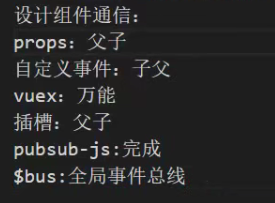
这里通过$bus实现header和search组件的通信。
$bus使用
（1）在main.js中注册

```js
new Vue({
  //全局事件总线$bus配置
  beforeCreate() {
    //此处的this就是这个new Vue()对象
    //网络有很多bus通信总结，原理相同，换汤不换药
    Vue.prototype.$bus = this
  },
  render: h => h(App),
  //router2、注册路由，此时组件中都会拥有$router $route属性
  router,
  //注册store,此时组件中都会拥有$store
  store
}).$mount('#app')
```
（2）search组件使用$bus通信，第一个参数可以理解为为通信的暗号，还可以有第二个参数（用于传递数据），我们这里只是用于通知header组件进行相应操作，所以没有设置第二个参数。
```js
//删除搜索关键字
      removeBreadParams(){
        this.searchParams.keyword = undefined
        //通知兄弟组件header删除输入框的keyword关键字
        this.$bus.$emit("clear")
        this.$router.push({name:'Search',query:this.$route.query})
      },
```
（3）header组件接受$bus通信
注意：组件挂载时就监听clear事件
```js
mounted() {
  //  组件挂载时就监听clear事件，clear事件在search模块中定义
  //  当删除关键字面包屑时，触发该事件，同时header的输入框绑定的keyword要删除
    this.$bus.$on("clear",()=>{
      this.keyword = ''
    })
  }
```
# 32、组件通信方式
**第一种父子组件通信：**

> $ on、$emit自定义事件实现子组件给父组件传递信息。 props实现父组件给子组件传递数据。

**第二种全局事件总线 $bus**（适用于所有的场景）
**第三种Vuex**
**第四中插槽**（适用于父子组件通信）


[组件通信方式连接](https://www.cnblogs.com/yszblog/p/10135969.html)
# 33、SearchSelector子组件传参及面包屑操作
在**31小节**中描述了通过query、params参数生成面包屑，以及面包屑的删除操作对应地址栏url的修改。
SearchSelector组件有两个属性也会生成面包屑，分别为品牌名、手机属性。如下图所示
此处生成面包屑时会涉及到子组件向父组件传递信息操作（在32小节有相关知识点），之后的操作和前面31小姐讲的面包屑操作原理相同。唯一的区别是，这里删除面包屑时不需要修改地址栏url，因为url是由路由地址确定的，并且只有query、params两个参数变化回影响路由地址变化。
在具体的操作内还会涉及一些小的知识点，例如
字符串拼接 ·${}·，使用方法如下

```js
var a = 1;
console.log(`a的值是：${a}`); //a的值是：1
```
至此面包屑部分内容结束。
总结：面包屑由四个属性影响：parads、query、品牌、手机属性
**面包屑生成逻辑**
判断searchParams相关属性是否存在，存在即显示。
**面包屑删除逻辑**
Search.vue js代码()
```js
<script>
  import SearchSelector from './SearchSelector/SearchSelector'
  import {mapGetters} from 'vuex'
  export default {
    name: 'Search',
    components: {
      SearchSelector
    },
    data(){
      return{
        //动态获取searchParams
        searchParams:{
          category1Id: "",//一级分类id
          category2Id: "",//二级分类id
          category3Id: "",//三级分类id
          categoryName: "",
          keyword: "",
          order: "1:desc",
          pageNo: 1,
          pageSize: 10,
          props: [],//平台售卖属性
          trademark: ""//品牌
        },
      }
    },
    //在组件挂在之前动态编辑searchParams的值，因为组件挂在之后会使用到searchParams
    beforeMount() {
      //Object.assign方法用于将所有可枚举属性的值从一个或多个源对象复制到目标对象。它将返回目标对象。
      //Object.assign 方法只会拷贝源对象自身的并且可枚举的属性到目标对象
      Object.assign(this.searchParams,this.$route.query,this.$route.params)
    },
    methods:{
      //搜索
      searchInfo(){
        this.$store.dispatch("getSearchListr",this.searchParams)
      },
      //删除分类(query)面包屑
      removeBread(){
        this.searchParams.categoryName = undefined
        this.$router.push({name:'Search',params:this.$route.params})
      },
      //删除搜索关键字(params)面包屑
      removeBreadParams(){
        this.searchParams.keyword = undefined
        //通知兄弟组件header删除输入框的keyword关键字
        this.$bus.$emit("clear")
        this.$router.push({name:'Search',query:this.$route.query})
      },
      //获取子组件传递的品牌信息（自定义事件）
      tradeMarkInfo(tradeMark){
        //接口文档中trademark的信息是"ID:品牌名称"形式
        this.searchParams.trademark = `${tradeMark.tmId}:${tradeMark.tmName}`
        this.searchInfo()
      },
      //删除品牌面包屑
      removeTradeMark(){
        this.searchParams.trademark = undefined
        this.searchInfo()
      },
      //获取子组件传递的属性信息（自定义事件）
      attrInfo(attr,attrValue){
        //searchParams.props元素为字符串形式，api文档有介绍
        let props = `${attr.attrId}:${attrValue}:${attr.attrName}`
        //数组去重
        if(this.searchParams.props.indexOf(props)===-1){
          this.searchParams.props.push(props)
          this.searchInfo()
        }
      },
      //删除属性面包屑
      removeAttr(index){
        this.searchParams.props.splice(index,1)
      }
    },
    mounted() {
      this.searchInfo()
    },
    computed:{
      ...mapGetters(['goodsList'])
    },
    //watch可以监听组件上的属性
    watch:{
      $route:{
        handler(newValue,oldValue){
          console.log(this.$route)
          Object.assign(this.searchParams,this.$route.query,this.$route.params)
          this.searchInfo()
          //如果下一次搜索时只有params参数，拷贝后会发现searchParams会保留上一次的query参数
          //所以每次请求结束后将相应参数制空
          this.searchParams.category1Id = '';
          this.searchParams.category2Id = '';
          this.searchParams.category3Id = '';
        },
      }
    },
  }
</script>
```
# 34、商品排序
排序的逻辑比较简单，只是改变一下请求参数中的order字段，后端会根据order值返回不同的数据来实现升降序。
order属性值为字符串，例如‘1：asc’、‘2：desc’。1代表综合，2代表价格，asc代表升序，desc代表降序。

我们的升降序是通过箭头图标来辨别的，如图所示：
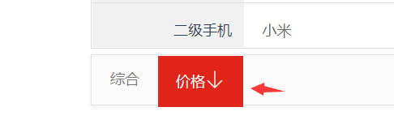
图标是iconfont网站的图标，通过引入在线css的方式引入图标
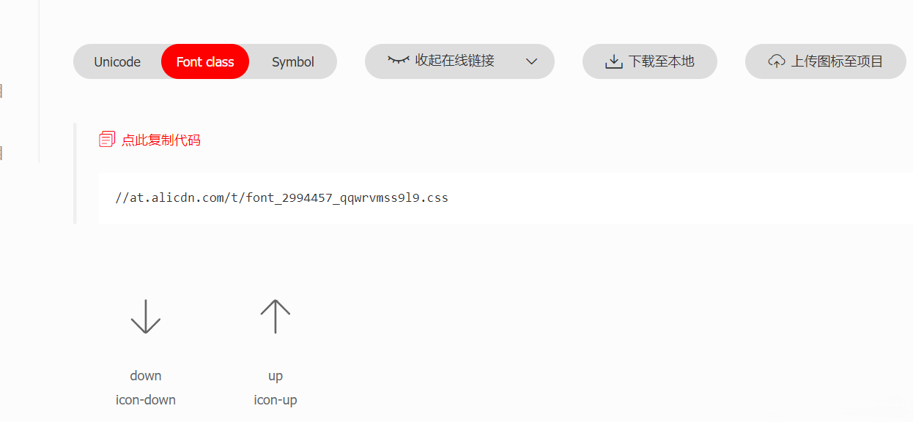
在public文件index引入该css
` <link rel="stylesheet" href="https://at.alicdn.com/t/font_2994457_qqwrvmss9l9.css">`

在search模块使用该图标
```js
<div class="sui-navbar">
            <div class="navbar-inner filter">
              <ul class="sui-nav">
<!-- 这里isOne、isTwo、isAsc、isDesc是计算属性，如果不使用计算属性要在页面中写很长的代码-->
                <li :class="{active:isOne}" @click="changeOrder('1')">
<!--                  阿里图标前置类iconfont-->
                  <a  >综合<span v-show="isOne" class="iconfont" :class="{'icon-up':isAsc,'icon-down':isDesc}"></span></a>
                </li>
                <li :class={active:isTwo} @click="changeOrder('2')">
                  <a >价格<span v-show="isTwo" class="iconfont" :class="{'icon-up':isAsc,'icon-down':isDesc}"></span></a>
                </li>
              </ul>
            </div>
          </div>
```
isOne、isTwo、isAsc、isDesc计算属性代码
```js
computed:{
      ...mapGetters(['goodsList']),
      isOne(){
        return this.searchParams.order.indexOf('1')!==-1
      },
      isTwo(){
        return this.searchParams.order.indexOf('2')!==-1
      },
      isDesc(){
        return this.searchParams.order.indexOf('desc')!==-1
      },
      isAsc(){
        return this.searchParams.order.indexOf('asc')!==-1
      },
    },
```
点击‘综合’或‘价格’的触发函数changeOrder
```js
//flag用于区分综合、价格，1：综合，2：价格
      changeOrder(flag){
        let newSearchOrder = this.searchParams.order
        //将order拆为两个字段orderFlag(1:2)、order(asc:desc)
        let orderFlag = this.searchParams.order.split(':')[0]
        let order = this.searchParams.order.split(':')[1]
        //由综合到价格、由价格到综合
        if(orderFlag!==flag){
          //点击的不是同一个按钮
          newSearchOrder = `${flag}:desc`
          this.searchInfo()
        }else{
          //多次点击的是不是同一个按钮
          newSearchOrder = `${flag}:${order==='desc'?'asc':'desc'}`
          }
        //需要给order重新赋值
        this.searchParams.order = newSearchOrder;
        //再次发请求
        this.searchInfo();
      }
```
# 35、手写分页器
实际开发中是不会手写的，一般都会用一些开源库封装好的分页，比如element ui。但是这个知识还是值得学习一下的。
核心属性：
pageNo（当前页码）、pageSize、total、continues（连续展示的页码）
核心逻辑是获取连续页码的起始页码和末尾页码，通过计算属性获得。（计算属性如果想返回多个数值，可以通过对象形式返回）
```js
  //连续页码的起始页码、末尾页码
    startNumAndEnd(){
      let start = 0 , end = 0;
      //规定连续页码数字5（totalPage至少5页）
      //不正常现象
      if(this.continues > this.totalPage){
        start = 1
        end = this.totalPage
      }else{
        //正常现象      Math.floor:想下取整
        start = this.pageNo - Math.floor(this.continues/2)
        end = this.pageNo + Math.floor(this.continues/2)
        //start出现不正常现象纠正
        if(start < 1){
          start = 1
          end = this.continues
        }
        //end出现不正常现象纠正
        if(end > this.totalPage){
          end = this.totalPage
          start = this.totalPage - this.continues + 1
        }
      }
      return {start,end}
    }
```
当点击页码会将pageNo传递给父组件，然后父组件发起请求，最后渲染。这里还是应用通过自定义事件实现子组件向父组件传递信息。
# 36、字符串拼接
如果你想在你的字符串内加入某个变量的值，就需要字符串拼接使用 ``（飘符号），由于 `飘`在markdown是单行代码标记所以下面我们用··代替。
字符串拼接 ·${}·，使用方法如下：
**在js中使用**
```js
var a = 1;
console.log(`a的值是：${a}`); //a的值是：1
```
**在html中使用**
```js
<router-link :to="`/detail/${goods.id}`"></router-link>
```
# 37、滚动条
使用前端路由，当切换到新路由时，想要页面滚到顶部，或者是保持原先的滚动位置，就像重新加载页面那样。 vue-router 能做到，而且更好，它让你可以自定义路由切换时页面如何滚动。
[router滚动行为](https://router.vuejs.org/zh/guide/advanced/scroll-behavior.html)
# 38、undefined细节(*****)
访问undefined的属性值会引起红色警告，可以不处理，但是要明白警告的原因。
以获取商品categoryView信息为例，categoryView是一个对象。
对应的getters代码
```js
const getters =  {
    categoryView(state){
        return state.goodInfo.categoryView
    }
}
```
对应的computed代码
```js
 computed:{
      ...mapGetters(['categoryView'])
    }
```
html代码
```js
<div class="conPoin">
        <span v-show="categoryView.category1Name" >{{categoryView.category1Name}}</span>
        <span v-show="categoryView.category2Name" >{{categoryView.category2Name}}</span>
        <span v-show="categoryView.category3Name" >{{categoryView.category3Name}}</span>
      </div>
```
下细节在于getters的返回值。如果getters按上面代码写为`return state.goodInfo.categoryView`，页面可以正常运行，但是会出现红色警告。
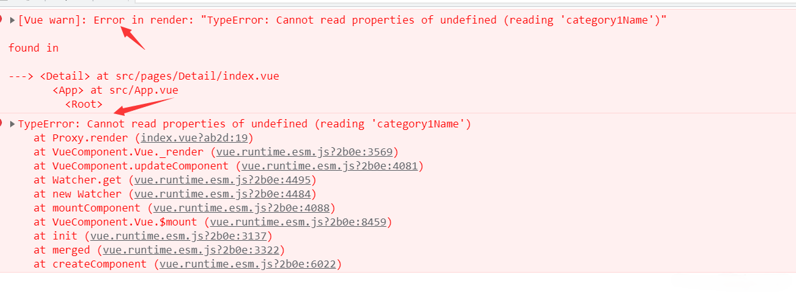
**原因**：假设我们网络故障，导致goodInfo的数据没有请求到，即goodInfo是一个空的对象，当我们去调用getters中的`return state.goodInfo.categoryView`时，因为goodInfo为空，所以也不存在categoryView，即我们getters得到的categoryView为undefined。所以我们在html使用该变量时就会出现没有该属性的报错。
即：网络正常时不会出错，一旦无网络或者网络问题就会报错。
**总结**：所以我们在写getters的时候要养成一个习惯在返回值后面加一个||条件。即当属性值undefined时，会返回||后面的数据，这样就不会报错。
如果返回值为对象加||{}，数组：||[ ]。
此处categoryView为对象，所以将getters代码改为`return state.goodInfo.categoryView||{}`

# 39、商品详情
商品详情唯一难点就是点击轮播图图片时，改变放大镜组件展示的图片。
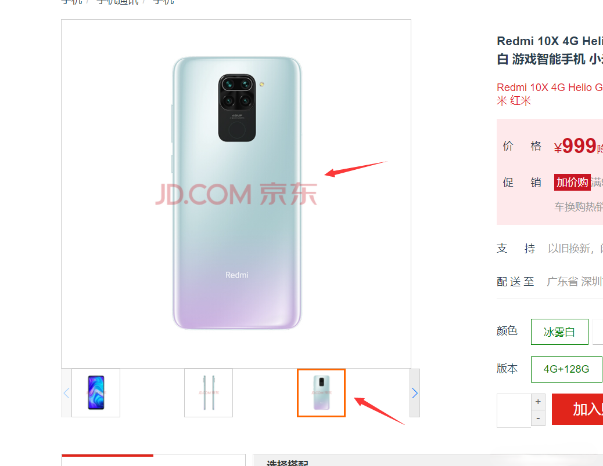
老师的方法很巧妙：在轮播图组件中设置一个currendIndex，用来记录所点击图片的下标，并用currendIndex实现点击图片高亮设置。当符合图片的下标满足`currentIndex===index`时，该图片就会被标记为选中。

```js
  <div class="swiper-container" ref="cur">
    <div class="swiper-wrapper">
      <div class="swiper-slide" v-for="(skuImage,index) in skuImageList" :key="skuImage.id">
        
      </div>
    </div>
    <div class="swiper-button-next"></div>
    <div class="swiper-button-prev"></div>
  </div>
```
轮播图组件和放大镜组件是兄弟组件，所以要通过全局总线通信。
在轮播图组件中，点击图片触发全局事件changeImg，参数为图片所在数组的下标。
```js
 changeImg(index){
        //将点击的图片标识位高亮
        this.currentIndex = index
        //通知兄弟组件修改大图图片
        this.$bus.$emit("changeImg",index)
      }
```
对应的放大镜组件，首先在mounted监听该全局事件
```js
mounted() {
      this.$bus.$on("changeImg",(index)=>{
        //修改当前响应式图片
        this.currentIndex = index;
      })
    },
```
放大镜组件中也会有一个currentIndex，他用表示大图中显示的图片的下标（因为放大镜组件只能显示一张图片），全局事件传递的index赋值给currentIndex ，通过computed计算属性改变放大镜组件展示的图片下标。
```js
computed:{
      imgObj(){
          return this.skuImageList[this.currentIndex] || {}
      }
    },
```
放大镜组件展示图片的html代码
```js

```
至于放大镜相关知识，因为之前没有学过，而且我只是想学习一下前端业务逻辑，所以就丢弃了放大镜相关知识。
**但是**我还是要贴一个链接，如果用到，直接模仿这个链接的内容就可以实现。[js实现放大镜](https://blog.csdn.net/weixin_40758850/article/details/89445629)
# 40、失焦事件
blur与change事件在绝大部分情况下表现都非常相似，输入结束后，离开输入框，会先后触发change与blur，唯有两点例外。
（1） 没有进行任何输入时，不会触发change。
在这种情况下，输入框并不会触发change事件，但一定会触发blur事件。在判断表单修改状态时，这种差异会非常有用，通过change事件能轻易地找到哪些字段发生了变更以及其值的变更轨迹。

（2）输入后值并没有发生变更。
这种情况是指，在没有失焦的情况下，在输入框内进行返回的删除与输入操作，但最终的值与原值一样，这种情况下，keydown、input、keyup、blur都会触发，但change依旧不会触发。
# 41、加入购物车成功路由
点击加入购物车时，会向后端发送API请求，但是该请求的返回值中data为null，所以我们只需要根据状态码code判断是否跳转到‘加入购物车成功页面’。
detail组件‘加入购物车’请求函数：
```js
async addShopCar() {
        try{
          await  this.$store.dispatch("addOrUpdateShopCart", {
            skuId: this.$route.params.skuId,
            skuNum: this.skuNum
          });
          //一些简单的数据，比如skuNum通过query传过去
          //复杂的数据通过session存储，
          //sessionStorage、localStorage只能存储字符串        sessionStorage.setItem("SKUINFO",JSON.stringify(this.skuInfo))
          this.$router.push({name:'AddCartSuccess',query:{'skuNum':this.skuNum}})
        }catch (error){
          alert(error.message)
        }

      }
```
detail store对应代码
```js
//将产品添加到购物车中
    async addOrUpdateShopCart({commit},{skuId,skuNum}){
        let result = await reqAddOrUpdateShopCart(skuId,skuNum)
        if(result.code === 200){
            return 'ok'
        }else{
            return Promise.reject(new Error('faile'))
        }
    }
```
其实这里当不满足`result.code === 200`条件时，也可以返回字符串‘faile’，自己在addShopCar中判断一下返回值，如果为‘ok’则跳转，如果为‘faile’(或者不为‘ok’)直接提示错误。当然这里出错时返回一个Promise.reject更加符合程序的逻辑。

> 跳转‘加入购物车成功页面’的同时要携带商品的信息。本项目只是传递的商品的一些标签属性，并没有传递商品的型号类别的信息，比如颜色、内存等信息，自己可以手动实现，比较简单。

当我们想要实现**两个毫无关系**的组件传递数据时，首相想到的就是路由的query传递参数，但是query适合传递单个数值的简单参数，所以如果想要**传递对象**之类的复杂信息，就可以通过**Web Storage**实现。

**sessionStorage、localStorage概念**：
**sessionStorage**：为每一个给定的源维持一个独立的存储区域，该区域在页面会话期间可用（即只要浏览器处于打开状态，包括页面重新加载和恢复）。
**localStorage**：同样的功能，但是在浏览器关闭，然后重新打开后数据仍然存在。
**注意**：无论是session还是local存储的值都是字符串形式。如果我们想要存储对象，需要在存储前JSON.stringify()将对象转为字符串，在取数据后通过JSON.parse()将字符串转为对象。
# 42、购物车组件开发
根据api接口文档封装请求函数
```js
export const reqGetCartList = () => {
return requests({
	url:'/cart/cartList',
	method:'GET'
})}
```
但是如果想要获取详细信息，还需要一个用户的uuidToken，用来验证用户身份。但是该请求函数没有参数，所以我们只能把uuidToken加在请求头中。

创建utils工具包文件夹，创建生成uuid的js文件，对外暴露为函数（记得导入uuid  => `npm install uuid`）。
**生成临时游客的uuid（随机字符串）,每个用户的uuid不能发生变化，还要持久存储**
```js
import {v4 as uuidv4} from 'uuid'
//生成临时游客的uuid（随机字符串）,每个用户的uuid不能发生变化，还要持久存储
export const getUUID = () => {
    //1、判断本地存储是否由uuid
    let uuid_token = localStorage.getItem('UUIDTOKEN')
    //2、本地存储没有uuid
    if(!uuid_token){
        //2.1生成uuid
        uuid_token = uuidv4()
        //2.2存储本地
        localStorage.setItem("UUIDTOKEN",uuid_token)
    }
    //当用户有uuid时就不会再生成
    return uuid_token
}
```
用户的uuid_token定义在store中的detail模块
```js
const state =  {
    goodInfo:{},
    //游客身份
    uuid_token: getUUID()
}
```
在request.js中设置请求头
```js
import store from '@/store';
requests.interceptors.request.use(config => {
    //config内主要是对请求头Header配置

    //1、先判断uuid_token是否为空
    if(store.state.detail.uuid_token){
        //2、userTempId字段和后端统一
        config.headers['userTempId'] = store.state.detail.uuid_token
    }
    //比如添加token

    //开启进度条
    nprogress.start();
    return config;
})
```
注意this.$store只能在组件中使用，不能再js文件中使用。如果要在js中使用，需要引入`import store from '@/store';`
# 43、购物车商品数量修改及个人疑问
1、购物车商品信息展示比较简单，就不多做赘述。
2、every函数使用

> every遍历某个数组，判断数组中的元素是否满足表达式，全部为满足返回true，否则返回false

例如判断底部勾选框是否全部勾选代码部分
```js
//判断底部勾选框是否全部勾选
      isAllCheck() {
        //every遍历某个数组，判断数组中的元素是否满足表达式，全部为满足返回true，否则返回false
        return this.cartInfoList.every(item => item.isChecked === 1)
      }
```
3、修改商品数量前端代码部分：
**注意**：通过@click、@change触发handler函数改变商品数量。
**引申**：在我自己写代码的同时，我发现，当使用函数的参数个数不同时，例如：handler('minus',-1,cartInfo)和 handler('minus',-1)，执行的还是同一个method的handler函数，只是对应的参数变为了undefined。即js不会像java一样，有代码的重载。
```js
 <li class="cart-list-con5">
     <a href="javascript:void(0)" class="mins" @click="handler('minus',-1,cartInfo)">-</a>
     <input autocomplete="off" type="text" :value="cartInfo.skuNum" @change="handler('change',$event.target.value,cartInfo)" minnum="1" class="itxt">
     <a href="javascript:void(0)" class="plus" @click="handler('add',1,cartInfo)">+</a>
 </li>
```
handler函数，修改商品数量时，加入**节流**操作。

> 添加到购物车和对已有物品进行数量改动使用的同一个api，可以查看api文档。
> handler函数有三个参数，type区分操作，disNum用于表示数量变化（正负）,cart商品的信息

```js
 //加入节流操作
 handler: throttle(async  function(type,disNum,cart){
       //减按钮判断当前数量是否为1
    if(type === 'minus') {
       //当商品数量为1是，不可以再减少
       if(cart.skuNum === 1){
           return;
       }
    }
   //输入框修改,难点：要判断输入的内容是否合法
    if(type === 'change'){
       //输入内容不合法时
        if(isNaN(disNum * 1)  || disNum <= 0){
          disNum = 0;
        }else{
          disNum = parseInt(disNum) - cart.skuNum
        }
    }
   //加按钮disNum不需要改变
   try{
       await this.$store.dispatch('addOrUpdateShopCart',{skuId:cart.skuId,skuNum:disNum})
    //商品数量修改成功后再次获取服务器数据
       await this.$store.dispatch("getCartList")

   }catch (error){
       alert(error)
   }
},100),
```
**个人疑点**：在最后一步更新商品信息时，我最初的想法时使用`this.$router.push('/shopcart')`实现。因为，我们shopcart页面的mounted会去获取商品信息。当路由跳转时会执行mounted的内容，实现商品数据信息更新。
```js
mounted(){
      this.$store.dispatch("getCartList")
    },
```
但是这样做不会更新商品数据，个人猜测原因是：因为我要跳往的路由和当前路由相同，并且路由参数没有改变，所以他就不会跳转。或者是会跳转。但是，因为路由信息没有变化，所以不会执行mounted函数。
**这里还是自己对路由和mounted内容不够了解，有了解的小伙伴可以帮我解答一下疑问吗？欢迎评论区解答。**
# 44、购物车状态修改和商品删除
这部分都比较简单，这里不多做赘述，唯一需要注意的是当store的action中的函数返回值data为null时，应该采用下面的写法（**重点是if，else部分**）

action部分：以删除购物车某个商品数据为例
```js
//修改购物车某一个产品的选中状态
    async reqUpdateCheckedById({commit},{skuId,isChecked}){
        let result = await reqUpdateCheckedById(skuId,isChecked)
        if(result.code === 200){
            return 'ok'
        }else{
            return Promise.reject(new Error('fail'))
        }
    }
```
method部分：（**重点是try、catch**）
```js
async reqUpdateCheckedById(cart,event){
        let isChecked = event.target.checked ? 1 :0
        try{
          await this.$store.dispatch("reqUpdateCheckedById",{skuId:cart.skuId,isChecked:isChecked})
          //修改成功，刷新数据
          this.$store.dispatch()
        }catch (error){
          this.$store.dispatch("getCartList")
        }
      }
```
# 45、删除多个商品（actions扩展）
由于后台只提供了删除单个商品的接口，所以要删除多个商品时，只能多次调用actions中的函数。
我们可能最简单的方法是在method的方法中多次执行dispatch删除函数，当然这种做法也可行，但是为了深入了解actions，我们还是要将批量删除封装为actions函数。
actions扩展
官网的教程，一个标准的actions函数如下所示：
```js
 deleteAllCheckedById(context) {
        console.log(context)

    }
```
我们可以看一下context到底是什么。

context中是包含dispatch、getters、state的，即我们可以在actions函数中通过dispatch调用其他的actions函数，可以通过getters获取仓库的数据。
这样我们的批量删除就简单了，对应的actions函数代码让如下

```js
/删除选中的所有商品
    deleteAllCheckedById({dispatch,getters}) {
        getters.getCartList.cartInfoList.forEach(item =>  {
            let result = [];
            //将每一次返回值添加到数组中
            result.push(item.isChecked === 1?dispatch('deleteCartById',item.skuId):'')
            
            
        })
	return Promise.all(result)
    },
```
上面代码使用到了Promise.all

> Promise.all可以将多个Promise实例包装成一个新的Promise实例。同时，成功和失败的返回值是不同的，成功的时候返回的是一个结果数组，而失败的时候则返回最先被reject失败状态的值。

购物车组件method批量删除函数
```js
//删除选中的所有商品
      async deleteAllCheckedById(){
        try{
          await this.$store.dispatch('deleteAllCheckedById')
          //删除成功，刷新数据
          this.$store.dispatch("getCartList")
        }catch (error){
          alert(error)
        }
      },
```
修改商品的全部状态和批量删除的原理相同，直接贴代价。
actions
```js
//修改购物车全部产品的选中状态
    async updateAllChecked({dispatch,getters},flag){
        let result = []
        getters.getCartList.cartInfoList.forEach(item => {
            result.push(dispatch('reqUpdateCheckedById',{skuId:item.skuId,isChecked:flag
            }))
        })
        return Promise.all(result)
    }
```
method
```js
 //修改全部商品的状态
      async allChecked(event){
         let flag =  event.target.checked ? 1 : 0
         console.log(flag)
         try{
           await this.$store.dispatch('updateAllChecked',flag)
           //修改成功，刷新数据
           this.$store.dispatch("getCartList")
         }catch (error){
           alert(error)
         }
      }
```
**bug纠正**
computed中的cartInfoList没有写[ ]返回值。当后台返回的购物车数据为空时，cartInfoList 就会为undefined，会导致后面的total、isAllCheck等计算属性使用到cartInfoList时产生计算错误。

正确代码:
```js
 cartInfoList(){
        return this.getCartList.cartInfoList || [];
      },
```
错误代码:
```js
 cartInfoList(){
        return this.getCartList.cartInfoList;
      },
```
# 46、注册登录业务(ES6  const新用法)
**1、ES6  const新用法**
```js
const {comment,index,deleteComment} = this 
```
上面的这句话是一个简写，最终的含义相当于:
```js
const  comment = this.comment
const  index = this.index
const   deleteComment = this.deleteComment
```

**2、用户注册模块**
actions部分(验证码部分省略)
```js
//用户注册
    async userRegister({commit},data){
        let result = await reqPostRegister(data)
        if(result.code === 200){
            return 'ok'
        }else{
            return Promise.reject(new Error(result.message))
        }
    }
```
methods注册功能
注册成功跳转到登陆页面，并且携带用户账号（个人完善）
```js
      async userRegister(){
        const{phone,password,code} = this
        try{
          phone && password && code && await this.$store.dispatch('userRegister',{phone,password,code})
          //注册成功跳转到登陆页面，并且携带用户账号
          await this.$router.push({path:'/login',query:{name:this.phone}})
        }catch (error){
          alert(error)
        }
      },
```
`this.$store.dispatch('userRegister',{phone,password,code})`因为K 、V相同，所以只传K
3、登录模块
前端部分内容
```js
			<form >
              <div class="input-text clearFix">
                <span></span>
                <input type="text" placeholder="邮箱/用户名/手机号" v-model="phone">
              </div>
              <div class="input-text clearFix">
                <span class="pwd"></span>
                <input type="password" placeholder="请输入密码" v-model="password">
              </div>
              <div class="setting clearFix">
                <label class="checkbox inline">
                  <input name="m1" type="checkbox" value="2" checked="">
                  自动登录
                </label>
                <span class="forget">忘记密码？</span>
              </div>
              <button class="btn" @click.prevent="goLogin">登&nbsp;&nbsp;录</button>
            </form>
```
由于登录按钮的父节点是一个form表单，如果使用@click触发登录事件，form表单会执行默认事件action实现页面跳转。这里我们使用`@click.prevent`，它可以阻止自身默认事件的执行。

actions登陆函数
```js
//登录
    async userLogin({commit},data){
        let result = await reqPostLogin(data)
        //服务器会返回token
        if(result.code === 200){
            //token存入vuex
            commit("SETUSERTOKEN",result.data.token)
            //持久化存储token
            localStorage.setItem('TOKEN',result.data.token)
            return 'ok'
        }else{
            return Promise.reject(new Error(result.message))
        }
    },
```
mutations设置用户token
```js
//设置用户token
    SETUSERTOKEN(state,token){
        state.token = token
    }
```
登陆组件methods登陆函数
```js
 async goLogin(){
        try{
          //会将this中的phone,password以对象的形式返回
          const {phone,password} = this
          phone && password && await this.$store.dispatch('userLogin',{phone,password})
          //路由跳转到home首页
          this.$router.push('/home')
        }catch (error){
          alert(error)
        }
      }
```
登陆成功后获取用户信息
actions函数
```js
async getUserInfo({commit}){
        let result = await reqGetUserInfo();
        //将用户信息存储到store中
        if(result.code === 200){
            //vuex存储用户信息
            commit('SETUSERINFO',result.data)
            return  'ok'
        }else{
            return Promise.reject(new Error(result.message))
        }
    },
```
mutations存储用户信息
```js
//存储用户信息
    SETUSERINFO(state,data){
        state.userInfo = data
    },
```
# 47、导航守卫
思路：直接看流程图
为什么要判断name？
> 因为store中的token是通过localStorage获取的，token有存放在本地。当页面刷新时，本地token不会消失，所以store中的token也不会消失。但是，store中的其他数据（用户信息等）会清空，此时会出现用户信息不存在，但是有token，这种情况是不可以访问其他页面的，必须先去获取用户信息。由于用户信息是一个对象，所以我们通过它的一个属性name判断用户信息是否存在。
> 所以不仅要判断token,还要判断用户信息


router index.js全局前置守卫代码
```js
//设置全局导航前置守卫
router.beforeEach(async(to, from, next) =>  {
    let token = store.state.user.token
    let name = store.state.user.userInfo.name
    //1、有token代表登录，全部页面放行
    if(token){
        //1.1登陆了，不允许前往登录页
        if(to.path==='/login'){
            next('/home')
        } else{
            //1.2、因为store中的token是通过localStorage获取的，token有存放在本地
            // 当页面刷新时，token不会消失，但是store中的其他数据会清空，
            // 所以不仅要判断token,还要判断用户信息

            //1.2.1、判断仓库中是否有用户信息，有放行，没有派发actions获取信息
            if(name)
                next()
            else{
                //1.2.2、如果没有用户信息，则派发actions获取用户信息
                try{
                    await store.dispatch('getUserInfo')
                    next()
                }catch (error){
                    //1.2.3、获取用户信息失败，原因：token过期
                    //清除前后端token，跳转到登陆页面
                    await store.dispatch('logout')
                    next('/login')
                }
            }
        }
    }else{
        //2、未登录，首页或者登录页可以正常访问
        if(to.path === '/login' || to.path === '/home' || to.path==='/register')
            next()
        else{
            alert('请先登录')
            next('/login')
        }
    }
})
```
# 48、交易模块
如果前面的知识你都理解了，后面的模块开发都会比较简单。无非就是老师讲到的开发四步骤
（1）封装API
（2）vuex三件套
（3）dispatch发请求
（4）数据渲染
**注意：**（3）中，如果在发请求之后还有一些对返回数据的操作，应考虑到是否需要async await。
**至此，个人认为本项目中的vue前端知识点应该就这些了，后面的相关组件开发，用到的知识在前面都有使用。如果有新知识，会继续更新。**

-------------------------------------------------分割线--------------------------------------------

但是，你一定希望将支付二维码换为你自己的二维码！
如果你直接使用项目中的图片,会出现图片损坏的图标。
解决方法：将你的二维码图片放入在博客文章中，然后就可以获取该图片的链接。
```js
 data(){
      return{
        payInfo:{},
        //支付二维码
        payImg: 'https://img-blog.csdnimg.cn/6d82f91e804545cc90d9182bc57ea4ad.jpg?x-oss-process=image/watermark,type_d3F5LXplbmhlaQ,shadow_50,text_Q1NETiBA5q-b5q-b6Jmr5ZGc5ZGc,size_19,color_FFFFFF,t_70,g_se,x_16',
        timer:null,//支付定时器
        code: '',//支付状态码
      }},
```
下面代码中涉及到计时器[setInterval()与setTimeout()计时器](https://www.cnblogs.com/lengyuehuahun/p/5650030.html)
```js
 //点击支付按钮，弹出支付二维码
      async opens(){

        this.$alert(``, '请使用微信扫码', {
          dangerouslyUseHTMLString: true,
          showCancelButton: true,
          center: true
        });
        //需要知道订单是否支付成功
        //成功则跳转，失败则提示信息
        if(!this.timer){
          //定时器间歇发送请求获取订单支付状态
          this.timer = setInterval(async ()=>{
            let result = await this.$API.reqGetPayStatus(this.payInfo.orderId)
            console.log(result)
            //因为每次支付都要花钱，所以直接205（支付中）就跳转了，
            if(result.code === 205){
              //1、清除定时器
              clearInterval(this.timer)
              this.timer = null
              //2、保存支付成功返回的code
              this.code = result.code
              //3、关闭弹出框
              this.$msgbox.close()
              //4、跳转到下一个路由
              this.$router.push('/paysuccess')
            }
          },1000)
        }
      }
```
效果展示
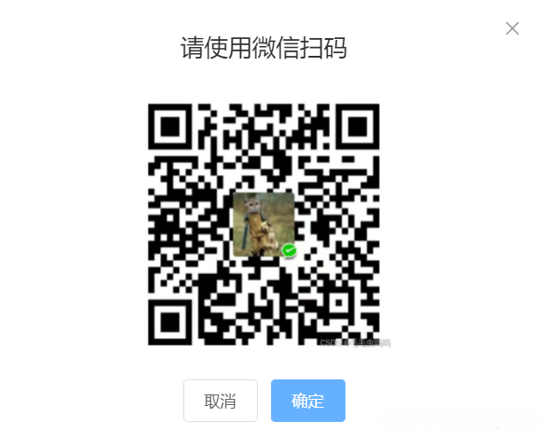
如果code===200跳转，我们必须支付后台提供的二维码，才会返回200，所以这里直接205就跳转了，后面的支付信息感觉没有意义了。所以，后面的支付内容就不写了。

## Vue图片引入
因为在引入我们个人支付二维码图片遇到了一些问题，所以这里就介绍一下图片引入的方式。
图片引入分两种：js内引入图片，非js内引入图片。

**非js内引入图片（html）**：一般都是通过路径引入，例如：``。

**js内引入图片**: 可分为通过路径引入和不通过路径引入。
1、如果想要通过**路径方式**在vue中的js引入图片，**必须require引入**。
例如：js中引入个人支付二维码可以通过下面方式实现
```js
this.$alert(``, '请使用微信扫码', {
          dangerouslyUseHTMLString: true,
          showCancelButton: true,
          center: true
        });
```
2、当然也可以不使用require，如果使用require，就不能通过路径方式引入。有两种方式：
（1）直接引入网页图片链接（前面引入个人收款码就是通过该方法实现）
（2）在< script >中通过import导入图片，然后在js中使用
```js
<script>
import payImg  from '@/assets/pay.jpg'
export default {
methods:{
      //点击支付按钮，弹出支付二维码1
      async opens(){
        this.$alert(``, '请使用微信扫码', {
          dangerouslyUseHTMLString: true,
          showCancelButton: true,
          center: true
        });
       }
}
</script>
```
[图片引入参考链接](https://blog.csdn.net/ze1024/article/details/108713082)

# 49、个人中心
终于用到了二级路由，虽然二级路由在后台管理系统常用，但是我们的个人中心也可以用到二级路由。
routers.js
**注意：** 二级路由要么不写/，要么写全：'/center/myorder'。
```js
//个人中心
    {
        name: 'Center',
        path: '/center',
        component:  () => import('@/pages/Center'),
        children: [
            {
                //二级路由要么不写/，要么写全：'/center/myorder'
                path: 'myorder',
                component: () => import('@/pages/Center/MyOrder')
            },
            {
                path: 'groupbuy',
                component: () => import('@/pages/Center/GroupOrder'),
            },
            //默认显示
            {
                path: '',
                redirect: 'myorder'
            }
        ]
    }
```
`
            {
                path: '',
                redirect: 'myorder'
           }`表示当我们访问center路由时，center中的router-view部分默认显示myorder二级路由内容。
我们的子路由最好放在父路由文件夹下，如下所示。
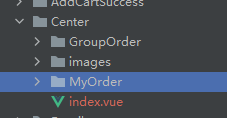
**警告**

图中内容如下：

> Named Route 'Center' has a default child route. When navigating to this named route (:to="{name: 'Center'"), the default child route will not be rendered. Remove the name from this route and use the name of the default child route for named links instead.

对应的代码
```js
//个人中心
    {
        name: 'Center',
        path: '/center',
        component:  () => import('@/pages/Center'),
        children: [
            {
                //二级路由要么不写/，要么写全：'/center/myorder'
                path: '/center/myorder',
                component: () => import('@/pages/Center/MyOrder')
            },
            {
                path: '/center/groupbuy',
                component: () => import('@/pages/Center/GroupOrder'),
            },
            //默认显示
            {
                path: '',
                redirect: 'myorder'
            }
        ]
    }
```
**总结警告缘由**：当某个路由有子级路由时，父级路由须要一个默认的路由，因此父级路由不能定义name属性，解决办法是去掉name:'Center'就好了。

我的订单部分使用到了之前写的分页器组件，当我再次使用时，我发现我已经快忘记这个分页器怎么写的了。个人觉得需要勤复习之前的知识点。
**老师这个手写的分页器很nice，涉及到一些分页逻辑还有父子双向通信**
# 50、路由独享的守卫(*****)
全局导航守卫已经帮助我们限制未登录的用户不可以访问相关页面。但是还会有一个问题。
例如：

> 用户已经登陆，用户在home页直接通过地址栏访问trade结算页面，发现可以成功进入该页面，正常情况，用户只能通过在shopcart页面点击去结算按钮才可以到达trade页面。我们可以通过路由独享守卫解决该问题

路由独享的守卫：只针对一个路由的守卫，所以该守卫会定义在某个路由中。
以上面问题为例，我们可以通过路由独享的守卫解决。
在trade路由信息中加入路由独享守卫
```js
//交易组件
    {
        name: 'Trade',
        path: '/trade',
        meta: {show:true},
        component:  () => import('@/pages/Trade'),
        //路由独享首位
        beforeEnter: (to, from, next) => {
          
            if(from.path ===  '/shopcart' ){
                next()
            }else{
                next(false)
            }
        }
    },
```
上面的代码已经实现了trade路由只能从shopcart路由跳转。`next(false)`指回到from路由。
但是，上面的代码还会有bug，就是当我们在shopcart页面通过地址栏访问trade时还是会成功。正常情况应该是只有当我们点击**去结算按钮**后才可以进入到trade页面。（这只是我个人观点）
**解决办法：**
在shopcart路由信息**meta**中加一个**flag**，初始值为false。当点击去结算按钮后，将flag置为true。在trade的独享路由守卫中判断一下flag是否为true，当flag为true时，代表是通过点击去结算按钮跳转的，所以就放行。
shopcart路由信息
```js
 //购物车
    {
        path: "/shopcart",
        name: 'ShopCart',
        component: ()=> import('../pages/ShopCart'),
        meta:{show: true,flag: false},
    },
```
shopcart组件去结算按钮触发事件
```js
toTrade(){
        this.$route.meta.flag = true
        this.$router.push('/trade')
      }
```
trade路由信息
```js
//交易组件
    {
        name: 'Trade',
        path: '/trade',
        meta: {show:true},
        component:  () => import('@/pages/Trade'),
        //路由独享首位
        beforeEnter: (to, from, next) => {
            if(from.path ===  '/shopcart' && from.meta.flag === true){
                from.meta.flag = false
                next()
            }else{
                next(false)
            }
        }
    },
```
**注意，判断通过后，在跳转之前一定要将flag置为false。**
# 51、图片懒加载
[懒加载vue-lazyload插件官网](https://www.npmjs.com/package/vue-lazyload)
插件的使用直接参考官方教程，很简单。

## vue使用插件的原理
每个插件都会有一个install方法，install后就可以在我们的代码中可以使用该插件。这个install有两类参数，第一个为Vue实例，后面的参数可以自定义。
vue使用插件的步骤
1、引入插件 `import VueLazyload from "vue-lazyload";`
2、注册插件`Vue.use(VueLazyload)`
这里的Vue.use()实际上就是调用了插件的install方法。如此之后，我们就可以使用该插件了。

#  52、表单验证
表单验证个人推荐使用element ui的from表单验证，看一下官网的示例就会用。
[element ui  from表单验证链接](https://element.eleme.cn/#/zh-CN/component/form)
# 53、路由懒加载
原来我一直使用的import()是路由懒加载，哈哈!，

当打包构建应用时，JavaScript 包会变得非常大，影响页面加载。如果我们能把不同路由对应的组件分割成不同的代码块，然后当路由被访问的时候才加载对应组件，这样就更加高效了。
[路由懒加载链接](https://router.vuejs.org/zh/guide/advanced/lazy-loading.html)
我还是喜欢下面的写法，不太喜欢官网的写法。
代码示例：
```js
  //详情页面组件
    {
        //需要params传参（产品id）
        path: "/detail/:skuId",
        name: 'Detail',
        component: ()=> import('../pages/Detail'),
        meta:{show: true},
    },
    //添加购物车成功
    {
        path: "/addcartsuccess",
        name: 'AddCartSuccess',
        component: ()=> import('../pages/AddCartSuccess'),
        meta:{show: true},
    },
```
# 54、打包项目
项目到此基本就完成了，接下来就是打包上线。在项目文件夹下执行`npm run build`。会生成dist打包文件。

dist就是我们打包好的项目文件
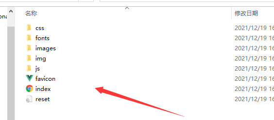
dist文件下的js文件存放我们所有的js文件，并且经过了加密，并且还会生成对应的map文件。

**map文件作用**：因为代码是经过加密的，如果运行时报错，输出的错误信息无法准确得知时那里的代码报错。有了map就可以向未加密的代码一样，准确的输出是哪一行那一列有错。

当然map文件也可以去除（map文件大小还是比较大的）
在vue.config.js配置`productionSourceMap: false`即可。
注意：vue.config.js配置改变，需要重启项目
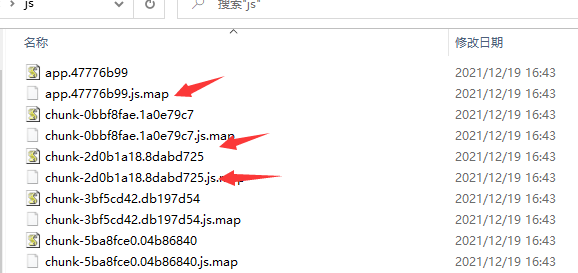

# 55、Vue新知识点（只针对个人）
## 1、DOM、事件、props个人理解
在vue中标签可以分为两类：
（1）原生DOM。`<input><buttonn>`等。
例如：
```js
<button  @click="handle" :msg="msg"></button>
```

> 这里的@click是原生DOM事件，也就是我们传统的点击触发事件。
>  这里的:msg就是绑定组件中的变量。

（2）自定义组件。比如我们之前自定义的分页器组件例如：
```js
<PageNation @click="getPageNo"
:pageNo="searchParams.pageNo"
:pageSize="searchParams.pageSize"
:total="totals" 
:continues="5"/>
```

> 这里的@click并不是原生DOM事件，而是我们自定义的事件。我们通常使用此类自定义事件实现子组件给父组件通信。（即在子组件中会有事件名为click的自定义事件）
> 这里的:pageNo是props，可以实现父组件给子组件传递信息。

**注意**：刚开始这里有一个问题，我们上面:continues="5"传递的明明是一个常量为什么还需要v-bind绑定事件呢？
官方解释

> 传递字符串常量：`<blog-post title="My journey with
> Vue"></blog-post>` 
> 传入一个数字 即便 `42` 是常量，我们仍然需要 `v-bind` 来告诉 Vue。这是一个 JavaScript 表达式而不是一个字符串 `<blog-post v-bind:likes="42"></blog-post>`

[props官方文档](https://cn.vuejs.org/v2/guide/components-props.html)
**总结**：原生DOM标签和自定义组件标签对v-bind和v-on的使用是不同的，含义也是不同的。
## 2、ref使用
我们可以通过ref获取组件的信息，并且可以写该组件的信息：
例如：**父组件想要获取子组件的信息或者修改子组件的数据**，就可以通过ref获取。

**使用步骤**：

> （1）在被操作的标签定义ref="name" 
> （2）在父组件可以通过this.$refs.name获取标签的全部信息，也可以进行数据的修改。

[ref使用参考链接](https://www.cnblogs.com/xumqfaith/p/7743387.html)

## 3、$ children $parent使用

> 在56小节中讲到，如果我们父组件想要获取修改子组件信息，可以通过ref实现。但是，当子组件较多时，就会出现多次的$refs操作，会十分的麻烦。所以，引入了children属性。

**children 属性**
每个组件都有children属性，可以通过this.$ children操作，该属性会返回当前组件的所有子组件信息，接下来就可以实现子组件信息的获取和修改。
**parent属性**
了解了children属性，那么parent也比较好理解。子组件可以通过parent属性获取父组件的全部信息，同样也可以修改父组件的信息。

**例题**：想要通过点击子组件，使得父组件的money变量减100。

> 不使用parents：子组件通过之前常用的自定事件来通知父组件修改money，然后父组件money执行减操作。
> 使用parents：子组件直接通过this.$parent属性获取父组件，然后在子组件内部对money执行减操作。

## 4、插槽使用
插槽也是可以用来传数据的
子组件HintButton 
```js
<template>
  <div>
    <slot  :item1="{'a':1,'b':2}" item2="asd1">e了吗</slot>
  </div>
</template>
```
父组件
```js
<template>
  <div>
    <HintButton title="提示" icon="el-icon-delete" type="danger" @click="handler">
      <template v-slot:default="slopProps" >
        <p>{{slopProps}}</p>
        <p>{{slopProps.item1}}</p>
        <p v-for="(item,index) in slopProps.item1">{{index}}----{{item}}</p>
      </template>
    </HintButton>
  </div>
</template>
```
**插槽的原理就是在子组件（HintButton）内定义一个slot（插槽），父组件可以向该插槽内插入数据。**
父组件向子组件传递信息还是通过props传递，这里就不多做赘述。
子组件想父组件传递信息时可以通过插槽传递。

> （1）在子组件HintButton的slot内绑定要传递的数据。
> （2） 父组件通过v-slot:default="slotProps"可以接收到全部的信息。

箭头所指内容就是子组件通过插槽传递给父组件的信息。接受的数据是键值对的形式。
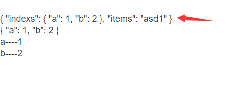

[插槽官方链接](https://cn.vuejs.org/v2/guide/components-slots.html#%E6%8F%92%E6%A7%BD%E5%86%85%E5%AE%B9)